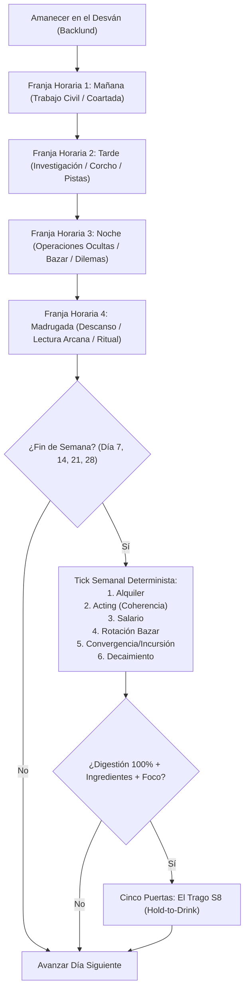
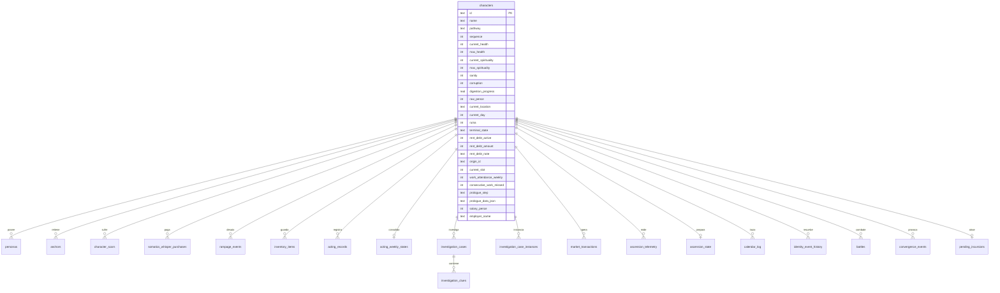
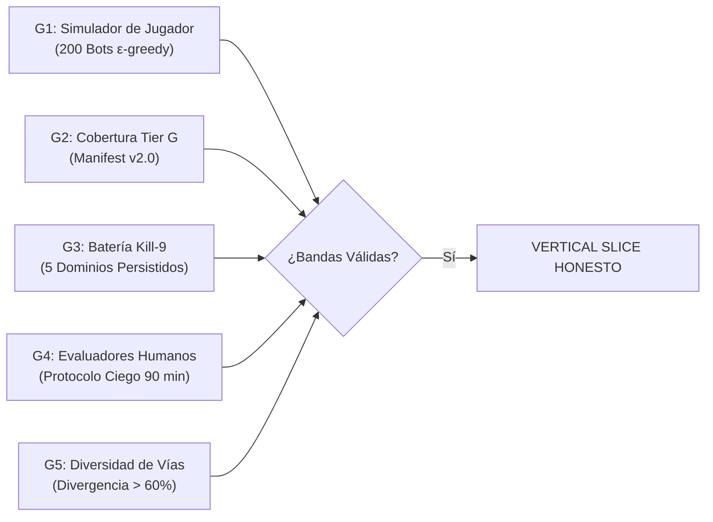

# PATH TO GODHOOD — BIBLIA TÉCNICA DEL MOTOR (LEGADO v4.0)
## Documento Maestro de Transferencia y Arquitectura del Sistema LOTM_ENGINE_REBORN

> **AVISO DE AUTORIDAD Y PROCEDENCIA:**
> Este documento constituye la autoridad técnica absoluta, definitiva y autosuficiente de *Path to Godhood* (*LOTM_ENGINE_REBORN*).
> Ha sido extraído al 100% mediante inspección directa del código fuente, esquemas relacionales, archivos de balance y manifiestos del repositorio.
> Un nuevo agente de desarrollo, provisto únicamente de este documento y de `AGENTS.md`, cuenta con la información íntegra para continuar el desarrollo del motor sin necesidad de explorar el historial conversacional previo ni escanear el repositorio.

---

## ÍNDICE GENERAL

1. [§0. Constitución del Motor](#0-constitución-del-motor)
2. [§1. Topología Limpia del Repositorio](#1-topología-limpia-del-repositorio)
3. [§2. Base de Datos y Persistencia Relacional](#2-base-de-datos-y-persistencia-relacional)
4. [§3. Doctrina de Datos de Dos Capas (Tier L / Tier G)](#3-doctrina-de-datos-de-dos-capas-tier-l--tier-g)
5. [§4. Anatomía Detallada de los 11 Motores Core](#4-anatomía-detallada-de-los-11-motores-core)
   - [4.1 SomaticsEngine](#41-somaticsengine)
   - [4.2 TacticalCombatEngine & AtomRuntime (GridCombat)](#42-tacticalcombatengine--atomruntime-gridcombat)
   - [4.3 ActingDilemmaEngine](#43-actingdilemmaengine)
   - [4.4 ProceduralInvestigationService & InvestigationEngine](#44-proceduralinvestigationservice--investigationengine)
   - [4.5 ConvergenceEngine](#45-convergenceengine)
   - [4.6 AscensionEngine](#46-ascensionengine)
   - [4.7 EconomyEngine](#47-economyengine)
   - [4.8 OriginEngine](#48-originengine)
   - [4.9 PrologueEngine](#49-prologueengine)
   - [4.10 CalendarEngine](#410-calendarengine)
   - [4.11 IdentityEngine](#411-identityengine)
6. [§5. Inventario Completo de Contenido Canónico](#5-inventario-completo-de-contenido-canónico)
7. [§6. Arquitectura Frontend Diegética (El Desván)](#6-arquitectura-frontend-diegética-el-desván)
8. [§7. Batería de Verdad: Gates G1 a G5](#7-batería-de-verdad-gates-g1-a-g5)
9. [§8. El Cementerio de Anti-Patrones y Lecciones Aprendidas](#8-el-cementerio-de-anti-patrones-y-lecciones-aprendidas)
10. [§9. Guía de Desarrollo para el Nuevo Agente](#9-guía-de-desarrollo-para-el-nuevo-agente)
11. [§10. Anexo de Verificación Técnica y Discrepancias](#10-anexo-de-verificación-técnica-y-discrepancias)

---

## §0. CONSTITUCIÓN DEL MOTOR

### 0.1 Identidad del Producto y Fantasía Central
- **El Producto:** *Path to Godhood* — RPG sistémico web de investigación, simulación de vida victoriana y horror cósmico en el universo de *Lord of the Mysteries* (Quinta Época, Backlund).
- **La Fantasía:** *"De día soy un civil con empleo, relaciones humanas y deudas en Backlund; de noche interpreto un papel sobrenatural que me está digiriendo. El conocimiento es munición y veneno. Cada secreto me hace más poderoso y más visible ante las deidades y los Halcones Nocturnos."*
- **Formato:** SPA React TypeScript en cliente (`ui/`) + API Server Fastify modular (`reborn/src/server/`) + Motor de dominio determinista puro (`reborn/src/core/`) + Base de datos SQLite relacional estricta bajo WAL (`reborn/src/infra/database/`).

### 0.2 Los Cinco Pilares Inviolables (C1 a C5)
1. **C1 · El Conocimiento es Poder:** Las habilidades enemigas son opacas hasta su identificación en combate (átomo `SCRUTINIZE`); los libros arcanos enseñan fórmulas y dañan la cordura; los epítetos y nombres honoríficos desbloquean rituales efectivos.
2. **C2 · El Acting es la Progresión:** No existe ganancia de puntos de experiencia (XP). La asimilación de pociones se obtiene exclusivamente interpretando el rol arquetípico de la Vía (`ActingDilemmaEngine`) evaluado semanalmente por Coherencia y Variedad.
3. **C3 · La Locura Distorsiona el Juego:** La degradación somática no es una barra genérica; inyecta opciones de susurro `[S]` a costa de anclas o memoria, distorsiona la percepción sensorial, genera cicatrices permanentes y desata eventos de Descontrol (*Rampage*) con salto temporal y secuelas forenses.
4. **C4 · Todo se Cobra:** La Mirada Cósmica y la Convergencia castigan el uso ostentoso de poderes y la Ruina acumulada; las deudas civiles y el alquiler impago traen a la policía y caseras hostiles; cada trago de poción arriesga el colapso mental.
5. **C5 · El Mundo se Mueve Sin Ti:** Los casos de investigación poseen caducidad temporal estricta (*expiry checkpoints* a los días 14, 21 y 30); si el jugador ignora las pistas, los culpables huyen o consolidan crímenes con consecuencias permanentes en el distrito.

### 0.3 El Macro-Loop de Juego


### 0.4 Las 14 Leyes Inviolables de Operación (AGENTS.md)
1. **Rutas Purgadas Muertas:** `/src` legado y `reborn/data/canonical/` fueron eliminados físicamente tras certificar paridad SHA-256 29/29 contra Tier L. Prohibido buscar, regenerar o referenciar dichas rutas.
2. **Prohibición de Métricas Tautológicas:** Prohibidos tests donde una función valida su propio mock o "auditories" con 100% falso. El avance se mide exclusivamente por los Gates de Verdad G1 a G7.
3. **Doctrina de Dos Capas:**
   - **Tier L (`reborn/data/content/`):** Biblioteca inmutable de lore. Se lee; jamás se edita directamente por agentes.
   - **Tier G (`reborn/data/gameplay/`):** Contrato jugable compilado validado por linters de CI (fail-loud).
4. **Balance Centralizado:** Todos los números, probabilidades, costes, daños y multiplicadores viven exclusivamente en `reborn/data/gameplay/balance/`. Cero números *magic constants* hardcodeados en código TS o JSONs de contenido.
5. **Persistencia Transaccional:** Todo estado de juego (batallas tácticas, pistas, casos, anclas, inventario, calendario) reside en SQLite (`DatabaseClient`). Prohibido almacenar estado en `Map` o memoria volátil.
6. **Resolución de Rutas Absoluta:** Prohibidas heurísticas relativas basadas en `process.cwd()`. Todas las rutas de datos se resuelven mediante `import.meta.url` y la raíz del paquete.
7. **Regla del Hueco (§3.8):** Un hueco de contenido jamás se inventa en línea. Hueco detectado $\to$ excepción de dominio + registro en cola `HUMAN_REVIEW`.
8. **Regla del Testigo (§3.9):** Ninguna operación destructiva se ejecuta sin commit previo del estado actual. Orden sagrada: **COMMIT primero, TAG después, DESTRUCCIÓN al final**.
9. **Formato Obligatorio de Reporte (§12 ampliado):** Cada entrega exige el Campo 0 obligatorio `COMMIT: <hash>` con URL de CI. Reporte sin Campo 0 = INVÁLIDO. Sección FALLOS obligatoria con evidencia.
10. **Regla Permanente de Procedencia de Gates (§3.10):** Toda re-corrida de un gate reporta DELTA contra la anterior + hipótesis causal. Todo umbral cita la orden formal que lo estableció.
11. **Erradicación Absoluta de Math.random (Tercera Huelga):** Prohibido `Math.random` en todo `reborn/src/`. Toda tirada, ID o selección estocástica usa `SeededRNG` o `generateDeterministicId`.
12. **Orígenes Canónicos Ratificados:** 6 orígenes canónicos aprobados en Tier G (`origins.json`): *Escribiente Notarial, Estudiante de Medicina, Corresponsal de Sucesos, Espiritista de Salón, Estibador de Muelles* y *Detective Privado*.
13. **Ley de Prosa Diegética:** Ningún string visible en UI contiene términos mecánicos explícitos ("HP: 100", "Sanidad: 85%", "Ruina: 5", "+15", nombres de sistemas matemáticos). Todo estado se expresa mediante objetos físicos y metáforas victorianas.
14. **Ley del Objeto (ESTADO = OBJETO. MOMENTO = PROSA):** Todo estado somático se renderiza como un objeto físico interactivo (la vela, el espejo de azogue, las grietas del marco). Etiquetas ambientales en reposo $\le 7$ palabras.

### 0.5 Reglas de Era Oficial (POST-LOTM · PRE-COI)
- **Era Oficial:** ~1353 Quinta Época, ~1 año posterior a la Guerra de los Dioses. Klein Moretti se encuentra en letargo; la Iglesia de la Noche ha absorbido la Vía del Gigante Crepuscular.
- **R1 (Historia):** Los eventos de la novela original son historia y estado del mundo consumible.
- **R2 (Leyenda):** Los personajes mayores canónicos son mitos/lore/raíces del telar; jamás actúan como NPCs operativos o líderes cotidianos.
- **R3 (Semillas Cósmicas):** Nada de *Circle of Inevitability* ha ocurrido; sus fuerzas existen únicamente como semillas cósmicas latentes en Tier L.
- **R4 (El Loco):** Su culto es embrionario, misterioso y LORE-ONLY. Klein duerme. Prohibido presentarlo como organización activa interactiva.
- **R5 (Naciones):** El Reino de Loen asimila las heridas de la guerra; la Iglesia del Dios del Combate fue destruida y absorbida por la Noche.

### 0.6 Encuadre de Fases y Ley de Estado
- **Fase 0 (Cimientos y Purga):** CERRADA formalmente.
- **BRIEF-08:** Cerró la fase de **SISTEMAS**.
- **Fase 1 (Vertical Slice Honesto):** **ABIERTA Y ACTIVA**. Comprende BRIEF-09 (Orígenes y Prólogo) + BRIEF-10 (El Desván) + BRIEF-10.VISUAL (El Desván como Lugar) + Gates G1 a G5 + G4 con evaluadores humanos + Demo diegética jugable firmada por el Director.
- **Regla Cardinal:** Ningún agente declara cambio de fase sin orden explícita y firmada del Director.

---

## §1. TOPOLOGÍA LIMPIA DEL REPOSITORIO

```
LOTM_SIMULADOR/
├── package.json                          # Workspace root (scripts unificados para reborn y ui)
├── .agentignore                          # Rutas ignoradas por agentes (excluye /src purgado)
├── AGENTS.md                             # Mapa operativo y leyes inviolables del proyecto
├── reborn/                               # Backend y núcleo del motor de juego (TypeScript / Fastify)
│   ├── package.json                      # Scripts de compilación, tests y linters del backend
│   ├── tsconfig.json                     # Configuración de compilación TS (ES2022 / NodeNext)
│   ├── docs/                             # Documentación constitucional y protocolos
│   │   ├── PATH_TO_GODHOOD_v4.md         # Constitución de producto, pilares y roadmap
│   │   ├── GATE_G4_HUMAN_TESTING_PROTOCOL.md # Protocolo de testeo ciego de 90 min
│   │   └── LEGADO.md                     # Este documento maestro de transferencia
│   ├── src/
│   │   ├── server/                       # Servidor Fastify y endpoints REST desacoplados
│   │   │   ├── app.ts                    # Fábrica buildApp(), CORS, errorHandler y registro de rutas
│   │   │   ├── server.ts                 # Entrypoint standalone para arranque HTTP (puerto 3000)
│   │   │   └── routes/                   # Plugins Fastify por dominio (acting, combat, etc.)
│   │   ├── core/                         # Motores de dominio puro y lógica determinista
│   │   │   ├── somatics/                 # SomaticsEngine (Sanidad, Corrupción, Ruina, Cicatrices)
│   │   │   ├── combat/                   # TacticalCombatEngine, AtomRuntime, GridCombatEngine
│   │   │   ├── acting/                   # ActingDilemmaEngine (Dilemas, Coherencia, Asimilación)
│   │   │   ├── investigation/            # InvestigationEngine, ProceduralInvestigationService
│   │   │   ├── convergence/              # ConvergenceEngine (Afinidad Séfira, Incursiones)
│   │   │   ├── ascension/                # AscensionEngine (Cinco Puertas, Telemetría)
│   │   │   ├── economy/                  # EconomyEngine (Alquiler, Bazar, Curas)
│   │   │   ├── origins/                  # OriginEngine (6 Orígenes Canónicos, Cargas)
│   │   │   ├── prologue/                 # PrologueEngine (Flujo de Onboarding Diegético)
│   │   │   ├── calendar/                 # CalendarEngine (Franjas Horarias, Tick Semanal)
│   │   │   ├── identity/                 # IdentityEngine (Doble Vida, Sospecha, 108 Eventos)
│   │   │   ├── errors/                   # DomainError y jerarquía semántica de excepciones
│   │   │   ├── rng/                      # SeededRNG y generateDeterministicId
│   │   │   ├── telemetry/                # SessionTelemetry (Registro de métricas diegéticas)
│   │   │   └── types/                    # Definiciones TypeScript canónicas del dominio
│   │   └── infra/                        # Adaptadores de infraestructura y persistencia
│   │       ├── data/                     # CanonicalDataLoader (Carga de compendios Tier L)
│   │       ├── database/                 # DatabaseClient, schema.sql, MigrationRunner
│   │       └── content/schemas/          # Schemas Zod para contratos Tier G
│   ├── data/
│   │   ├── content/                      # TIER L: Biblioteca congelada (67 JSONs, hashes SHA-256)
│   │   │   ├── manifest.json             # Manifiesto maestro con metadata y hashes
│   │   │   ├── pathways/                 # 22 Vías Canónicas completas (S9 a S0)
│   │   │   ├── artifacts/                # Artefactos sellados, Sefirot y características
│   │   │   ├── bestiary_npcs/            # NPCs y bestiario de la Quinta Época
│   │   │   ├── events/                   # Identity events (108) y pathway events (462)
│   │   │   ├── investigations/           # 50 esqueletos de casos y 210 conspiraciones
│   │   │   ├── lore_knowledge/           # Libros arcanos (100) y nombres honoríficos
│   │   │   ├── quests/                   # Semillas de misiones por secuencia
│   │   │   └── world/                    # Deidades, iglesias, facciones y naciones
│   │   └── gameplay/                     # TIER G: Contrato jugable compilado
│   │       ├── balance/                  # TABLAS GLOBALES DE BALANCE (Autoridad numérica única)
│   │       │   ├── acting.json           # Balance de actuación, coherencia y decaimiento
│   │       │   ├── atom_vocabulary.json  # Vocabulario canónico de 17 átomos de combate
│   │       │   ├── convergence.json      # Factores de convergencia, fuentes e incursiones
│   │       │   ├── dilemma_effects.json  # Perfiles de efecto para dilemas de acting
│   │       │   ├── economy.json          # Alquiler, modificadores de calidad y curas
│   │       │   ├── somatics.json         # Tiers de ruina, anclas, cicatrices y rampage
│   │       │   └── status_matrix.json    # Matriz de interacción entre 8 estados de combate
│   │       ├── abilities/                # 12 habilidades de jugador (Fool y Visionary)
│   │       ├── artifacts/                # 16 artefactos compilados a átomos
│   │       ├── cases/                    # Caso #1 "El Eco en el Nido Vacío" (Truth Model)
│   │       ├── combatants/               # 28 combatientes con opacidad y perfiles atómicos
│   │       ├── conspiracies/             # Conspiraciones activas del Telar
│   │       ├── dilemmas/                 # 16 dilemas compilados (Fool y Visionary)
│   │       ├── economy/                  # Catálogo del mercado clandestino de Cherwood
│   │       ├── lore/                     # Grimorios y lecturas activas
│   │       ├── npc_weeks/                # 39 rutinas semanales estructuradas
│   │       ├── origins/                  # 6 plantillas de orígenes canónicos
│   │       ├── pathways.manifest.json    # Catálogo de 22 vías y 6 jugables
│   │       ├── sefira_groups.json        # Mapeo formal de 9 grupos Séfira a 22 vías
│   │       └── world_state.json          # Estado del mundo ~1353 (20/20 mitos activos)
│   ├── tests/                            # Suites de prueba reales (21 suites, 136 tests)
│   └── scripts/                          # Herramientas de linting, determinismo y auditoría
└── ui/                                   # Frontend React (TypeScript + Vite + Lucide)
    ├── package.json                      # Dependencias cliente (react, lucide-react, tailwind)
    ├── tsconfig.json
    ├── vite.config.ts                    # Configuración Vite con proxy a API Fastify
    └── src/
        ├── App.tsx                       # Orquestador diegético y selector de vistas
        ├── main.tsx                      # Punto de entrada React 18
        ├── index.css                     # Estilos globales y paleta victoriana (ébano, oro viejo)
        ├── styles/textures.css           # Efectos de pergamino, vidrio y ceniza
        ├── features/                     # Vistas y componentes por feature
        │   ├── desk/                     # El Desván: mesa de trabajo y objetos cinéticos
        │   │   ├── DeskView.tsx          # Vista principal del escritorio
        │   │   └── objects/              # Objetos físicos (Vela, Espejo, Grietas, Billetera, etc.)
        │   ├── prologue/                 # Prólogo diegético y Hold-to-Drink
        │   ├── investigation/            # Corcho de detective y conexiones de hilos Bézier
        │   ├── acting/                   # Espejo de actuación y toma de decisiones
        │   ├── market/                   # Puesto del boticario y mercado negro
        │   ├── combat/                   # Teatro táctico de combate
        │   ├── ascension/                # Evaluación de las Cinco Puertas y cáliz ritual
        │   ├── calendar/                 # Gestión de jornada laboral y franjas
        │   └── veil/                     # Velo Ocultista y superposiciones arcanas
        └── components/                   # Componentes visuales secundarios
```

---

## §2. BASE DE DATOS Y PERSISTENCIA RELACIONAL

### 2.1 Motor y Configuración Transaccional
- **Driver:** `node:sqlite` (`DatabaseSync`), integrado en el runtime de Node.js 22+.
- **Modo de Diario:** `PRAGMA journal_mode = WAL;` (Write-Ahead Logging para concurrencia e integridad).
- **Integridad Referencial:** `PRAGMA foreign_keys = ON;` (Obligatorio en cada conexión).
- **Patrón de Acceso:** Aislado estrictamente a través de `DatabaseClient.ts`.
- **Migraciones:** Ejecutadas por `MigrationRunner.ts` con control de versiones en `schema_migrations`.

### 2.2 Esquema Relacional Completo (22 Tablas)



#### Detalle de Definición de Tablas (DDL Canónico)

1. **`characters`:** Estado del personaje principal.
   - Columnas: `id TEXT PRIMARY KEY`, `name TEXT NOT NULL`, `pathway TEXT NOT NULL`, `sequence INTEGER NOT NULL CHECK (sequence >= 0 AND sequence <= 9)`, `current_health INTEGER NOT NULL CHECK (current_health >= 0)`, `max_health INTEGER NOT NULL CHECK (max_health > 0)`, `current_spirituality INTEGER NOT NULL CHECK (current_spirituality >= 0)`, `max_spirituality INTEGER NOT NULL CHECK (max_spirituality > 0)`, `sanity INTEGER NOT NULL CHECK (sanity >= 0 AND sanity <= 100)`, `corruption INTEGER NOT NULL CHECK (corruption >= 0 AND corruption <= 100)`, `digestion_progress REAL NOT NULL CHECK (digestion_progress >= 0.0 AND digestion_progress <= 100.0)`, `raw_pence INTEGER NOT NULL DEFAULT 7200`, `current_location TEXT NOT NULL`, `current_day INTEGER NOT NULL DEFAULT 1`, `ruina INTEGER NOT NULL DEFAULT 0 CHECK (ruina >= 0)`, `terminal_state TEXT DEFAULT NULL CHECK (terminal_state IN (NULL, 'ALIVE', 'DEAD', 'LOST', 'TRANSFORMED', 'NPC_CONVERTED', 'SPECIAL_END'))`, `rent_debt_active INTEGER NOT NULL DEFAULT 0`, `rent_debt_amount INTEGER NOT NULL DEFAULT 0`, `rent_debt_note TEXT`, `origin_id TEXT`, `current_slot INTEGER NOT NULL DEFAULT 0 CHECK (current_slot >= 0 AND current_slot <= 3)`, `work_attendance_weekly INTEGER NOT NULL DEFAULT 0`, `consecutive_work_missed INTEGER NOT NULL DEFAULT 0`, `prologue_step TEXT NOT NULL DEFAULT 'COMPLETED'`, `prologue_data_json TEXT NOT NULL DEFAULT '{}'`, `salary_pence INTEGER NOT NULL DEFAULT 240`, `employer_name TEXT NOT NULL DEFAULT ''`, `created_at TEXT NOT NULL`, `updated_at TEXT NOT NULL`.
2. **`personas`:** Identidades civiles para la doble vida.
   - Columnas: `id TEXT PRIMARY KEY`, `character_id TEXT NOT NULL REFERENCES characters(id) ON DELETE CASCADE`, `legal_name TEXT NOT NULL`, `profession TEXT NOT NULL`, `social_class TEXT NOT NULL CHECK (social_class IN ('POOR', 'WORKING_CLASS', 'MIDDLE_CLASS', 'ARISTOCRAT'))`, `district TEXT NOT NULL`, `police_suspicion INTEGER NOT NULL DEFAULT 5 CHECK (police_suspicion >= 0 AND police_suspicion <= 100)`, `church_suspicion INTEGER NOT NULL DEFAULT 5 CHECK (church_suspicion >= 0 AND church_suspicion <= 100)`, `human_anchors INTEGER NOT NULL DEFAULT 35`, `is_active INTEGER NOT NULL DEFAULT 1`, `is_compromised INTEGER NOT NULL DEFAULT 0`, `created_at TEXT NOT NULL`.
3. **`anchors`:** Anclas de humanidad (personas, lugares, convicciones, rutinas).
   - Columnas: `id TEXT PRIMARY KEY`, `character_id TEXT NOT NULL REFERENCES characters(id) ON DELETE CASCADE`, `title TEXT NOT NULL`, `strength INTEGER NOT NULL CHECK (strength >= 0 AND strength <= 100)`, `category TEXT NOT NULL DEFAULT 'ROUTINE'`, `type TEXT NOT NULL DEFAULT 'ROUTINE'`, `name TEXT NOT NULL DEFAULT ''`, `description TEXT NOT NULL DEFAULT ''`, `damage_count INTEGER NOT NULL DEFAULT 0`, `is_destroyed INTEGER NOT NULL DEFAULT 0`, `created_at TEXT NOT NULL`.
4. **`character_scars`:** Cicatrices permanentes somáticas y mentales.
   - Columnas: `id TEXT PRIMARY KEY`, `character_id TEXT NOT NULL REFERENCES characters(id) ON DELETE CASCADE`, `scar_code TEXT NOT NULL`, `name TEXT NOT NULL`, `narrative TEXT NOT NULL`, `origin_anchor_id TEXT`, `is_severe INTEGER NOT NULL DEFAULT 0`, `mechanics_json TEXT NOT NULL DEFAULT '[]'`, `created_at TEXT NOT NULL`.
5. **`somatics_whisper_purchases`:** Registro de compras de opciones de susurro `[S]`.
   - Columnas: `id TEXT PRIMARY KEY`, `character_id TEXT NOT NULL REFERENCES characters(id) ON DELETE CASCADE`, `dilemma_id TEXT NOT NULL`, `choice_id TEXT NOT NULL`, `price_paid_json TEXT NOT NULL`, `advantage_granted_json TEXT NOT NULL`, `day INTEGER NOT NULL`, `created_at TEXT NOT NULL`.
6. **`rampage_events`:** Registro de descontrol somático y reconstrucción forense.
   - Columnas: `id TEXT PRIMARY KEY`, `character_id TEXT NOT NULL REFERENCES characters(id) ON DELETE CASCADE`, `trigger_reason TEXT NOT NULL`, `start_day INTEGER NOT NULL`, `end_day INTEGER NOT NULL`, `hours_skipped INTEGER NOT NULL`, `damaged_anchor_id TEXT`, `district_impact_json TEXT NOT NULL`, `case_impact_json TEXT NOT NULL`, `reconstruction_dossier_json TEXT NOT NULL`, `wake_narrative TEXT NOT NULL`, `created_at TEXT NOT NULL`.
7. **`inventory_items`:** Pertenencias, pociones, ingredientes y artefactos.
   - Columnas: `id TEXT PRIMARY KEY`, `character_id TEXT NOT NULL REFERENCES characters(id) ON DELETE CASCADE`, `item_code TEXT NOT NULL`, `name TEXT NOT NULL`, `category TEXT NOT NULL CHECK (category IN ('INGREDIENT', 'CHARACTERISTIC', 'POTION', 'SEALED_ARTIFACT', 'CONSUMABLE', 'DOCUMENT', 'WEAPON'))`, `grade INTEGER CHECK (grade IN (0, 1, 2, 3))`, `quantity INTEGER NOT NULL DEFAULT 1`, `metadata_json TEXT DEFAULT '{}'`, `quality TEXT NOT NULL DEFAULT 'PRISTINE'`, `is_equipped INTEGER NOT NULL DEFAULT 0`, `created_at TEXT NOT NULL`.
8. **`acting_records`:** Registro de resoluciones de dilemas de actuación.
   - Columnas: `id TEXT PRIMARY KEY`, `character_id TEXT NOT NULL REFERENCES characters(id) ON DELETE CASCADE`, `pathway TEXT NOT NULL`, `sequence INTEGER NOT NULL`, `dilemma_id TEXT NOT NULL`, `choice_id TEXT NOT NULL`, `digestion_gained REAL NOT NULL`, `sanity_delta INTEGER NOT NULL`, `alignment INTEGER DEFAULT 0`, `acting_weight REAL DEFAULT 1.0`, `decay_applied REAL DEFAULT 1.0`, `day INTEGER NOT NULL`, `narrative_log TEXT NOT NULL`, `created_at TEXT NOT NULL`.
9. **`acting_weekly_states`:** Consolidación semanal de coherencia y digestión.
   - Columnas: `character_id TEXT PRIMARY KEY REFERENCES characters(id) ON DELETE CASCADE`, `current_week INTEGER NOT NULL DEFAULT 1`, `coherence REAL NOT NULL DEFAULT 0.0`, `variety_penalty REAL NOT NULL DEFAULT 0.0`, `instability_flag INTEGER NOT NULL DEFAULT 0`, `loss_of_self_risk_flag INTEGER NOT NULL DEFAULT 0`, `weekly_records_json TEXT NOT NULL DEFAULT '[]'`, `history_json TEXT NOT NULL DEFAULT '[]'`, `updated_at TEXT NOT NULL`.
10. **`investigation_cases`:** Casos de investigación (registro relacional base).
    - Columnas: `id TEXT PRIMARY KEY`, `character_id TEXT NOT NULL REFERENCES characters(id) ON DELETE CASCADE`, `case_code TEXT NOT NULL`, `title TEXT NOT NULL`, `district TEXT NOT NULL`, `status TEXT NOT NULL CHECK (status IN ('OPEN', 'EVIDENCE_COLLECTED', 'READY_FOR_DEDUCTION', 'SOLVED', 'FAILED', 'COVERED_UP'))`, `culprit_name TEXT NOT NULL`, `verdict_action TEXT`, `reward_pence INTEGER NOT NULL DEFAULT 0`, `created_day INTEGER NOT NULL`.
11. **`investigation_clues`:** Pistas asociadas a los casos base.
    - Columnas: `id TEXT PRIMARY KEY`, `case_id TEXT NOT NULL REFERENCES investigation_cases(id) ON DELETE CASCADE`, `clue_code TEXT NOT NULL`, `title TEXT NOT NULL`, `description TEXT NOT NULL`, `clue_type TEXT NOT NULL CHECK (clue_type IN ('FORENSIC', 'SPIRITUAL', 'TESTIMONY', 'DOCUMENT'))`, `is_discovered INTEGER NOT NULL DEFAULT 0`.
12. **`investigation_case_instances`:** Instancias activas con grafo de pistas, conexiones, hipótesis y caducidad.
    - Columnas: `id TEXT PRIMARY KEY`, `character_id TEXT NOT NULL REFERENCES characters(id) ON DELETE CASCADE`, `case_id TEXT NOT NULL`, `status TEXT NOT NULL CHECK (status IN ('DORMANT', 'ACTIVE', 'RESOLVED', 'EXPIRED'))`, `state_json TEXT NOT NULL`, `created_at TEXT NOT NULL`, `updated_at TEXT NOT NULL`.
13. **`districts`:** Parámetros de tensión y convergencia por distrito.
    - Columnas: `id TEXT PRIMARY KEY`, `city TEXT NOT NULL DEFAULT 'Backlund'`, `district_name TEXT NOT NULL`, `tension_level INTEGER NOT NULL DEFAULT 10`, `inquisitorial_alert INTEGER NOT NULL DEFAULT 10`, `convergence_index INTEGER NOT NULL DEFAULT 5`, `last_incident_day INTEGER DEFAULT 0`.
14. **`market_transactions`:** Registro de compras, ventas y tratamientos somáticos.
    - Columnas: `id TEXT PRIMARY KEY`, `character_id TEXT NOT NULL REFERENCES characters(id) ON DELETE CASCADE`, `type TEXT NOT NULL CHECK (type IN ('BUY', 'SELL', 'CURE'))`, `item_code TEXT`, `quality TEXT`, `pence_amount INTEGER NOT NULL`, `day INTEGER NOT NULL`, `description TEXT NOT NULL DEFAULT ''`, `created_at TEXT NOT NULL`.
15. **`ascension_telemetry`:** Telemetría de hesitación en el Primer Trago y ascensos.
    - Columnas: `id TEXT PRIMARY KEY`, `character_id TEXT NOT NULL REFERENCES characters(id) ON DELETE CASCADE`, `target_sequence INTEGER NOT NULL`, `target_pathway TEXT NOT NULL`, `outcome TEXT NOT NULL CHECK (outcome IN ('SUCCESS', 'RAMPAGE'))`, `presented_at INTEGER NOT NULL`, `confirmed_at INTEGER NOT NULL`, `hesitation_ms INTEGER NOT NULL`, `preparation_score INTEGER NOT NULL`, `quality_average TEXT NOT NULL`, `created_at TEXT NOT NULL`.
16. **`ascension_state`:** Estado persistente de preparación ritual (tolerancia Kill-9).
    - Columnas: `character_id TEXT PRIMARY KEY REFERENCES characters(id) ON DELETE CASCADE`, `current_step TEXT NOT NULL CHECK (current_step IN ('CHECKLIST_IN_PROGRESS', 'TRAGO_PRESENTED', 'COMPLETED', 'FAILED'))`, `presented_at INTEGER`, `checklist_json TEXT NOT NULL DEFAULT '{}'`, `formula_id TEXT`, `updated_at TEXT NOT NULL`.
17. **`calendar_log`:** Registro de acciones por franja horaria.
    - Columnas: `id TEXT PRIMARY KEY`, `character_id TEXT NOT NULL REFERENCES characters(id) ON DELETE CASCADE`, `day INTEGER NOT NULL`, `slot INTEGER NOT NULL`, `event_type TEXT NOT NULL`, `subsystem TEXT NOT NULL`, `step_order INTEGER NOT NULL DEFAULT 0`, `details_json TEXT NOT NULL DEFAULT '{}'`, `created_at TEXT NOT NULL`.
18. **`identity_event_history`:** Historial de eventos de doble vida resueltos.
    - Columnas: `id TEXT PRIMARY KEY`, `character_id TEXT NOT NULL REFERENCES characters(id) ON DELETE CASCADE`, `event_id TEXT NOT NULL`, `event_category TEXT NOT NULL`, `chosen_option_index INTEGER NOT NULL`, `day INTEGER NOT NULL`, `slot INTEGER NOT NULL`, `stat_outcome_json TEXT NOT NULL DEFAULT '{}'`, `created_at TEXT NOT NULL`.
19. **`battles`:** Estado persistente de combate táctico por turnos.
    - Columnas: `id TEXT PRIMARY KEY`, `character_id TEXT NOT NULL REFERENCES characters(id) ON DELETE CASCADE`, `state_json TEXT NOT NULL`, `status TEXT NOT NULL CHECK (status IN ('ONGOING', 'VICTORY', 'DEFEAT', 'FLED', 'RAMPAGE_TERMINAL'))`, `created_at TEXT NOT NULL`, `updated_at TEXT NOT NULL`.
20. **`convergence_events`:** Eventos que alteran el índice de convergencia distrital.
    - Columnas: `id TEXT PRIMARY KEY`, `character_id TEXT NOT NULL REFERENCES characters(id) ON DELETE CASCADE`, `district_id TEXT NOT NULL`, `event_type TEXT NOT NULL CHECK (event_type IN ('PUBLIC_COMBAT', 'ASCENSION', 'ECCLESIASTICAL_DILEMMA', 'WHISPER_PURCHASE', 'DECAY'))`, `index_delta INTEGER NOT NULL`, `resulting_index INTEGER NOT NULL`, `day INTEGER NOT NULL`, `created_at TEXT NOT NULL`.
21. **`pending_incursions`:** Incursiones activas de escuadrones de Halcones Nocturnos.
    - Columnas: `id TEXT PRIMARY KEY`, `character_id TEXT NOT NULL UNIQUE REFERENCES characters(id) ON DELETE CASCADE`, `district_id TEXT NOT NULL`, `squad_type TEXT NOT NULL DEFAULT 'NIGHTHAWKS_SQUAD'`, `church_suspicion_snapshot INTEGER NOT NULL`, `status TEXT NOT NULL CHECK (status IN ('PENDING', 'ENGAGED', 'RESOLVED', 'FLED'))`, `day INTEGER NOT NULL`, `created_at TEXT NOT NULL`, `updated_at TEXT NOT NULL`.
22. **`schema_migrations`:** Control de versiones de migraciones aplicadas.
    - Columnas: `version TEXT PRIMARY KEY`, `applied_at TEXT NOT NULL`.

---

## §3. DOCTRINA DE DATOS DE DOS CAPAS (TIER L / TIER G)

### 3.1 Separación Arquitectónica
- **Tier L (`reborn/data/content/`):** Biblioteca pasiva de conocimiento congelada bajo `manifest.json` v2.0 (67 archivos, 3.10 MB, 22 vías canónicas, 100 libros arcanos, 210 conspiraciones, 100 NPCs, 124 artefactos). No contiene lógica ejecutable ni balance activo. Su integridad está protegida por hashes SHA-256 inmutables validados en CI vía `npm run verify:tier-l`.
- **Tier G (`reborn/data/gameplay/`):** Contrato jugable compilado. Cada archivo posee un esquema Zod estricto en `reborn/src/infra/content/schemas/` que se valida en tiempo de compilación mediante `npm run lint:tier-g`. Si un archivo de Tier G falta o viola su contrato, el build falla estrepitosamente (*fail-loud*).

### 3.2 Los 9 Grupos Séfira y las 22 Vías Canónicas (`sefira_groups.json`)
La convergencia mística opera mediante atracción entre vías del mismo grupo Séfira:

| Grupo Séfira | Nombre Místico | Vías Pertenecientes (22 Canónicas) | Dominio en Fase 1 |
| :--- | :--- | :--- | :--- |
| **`LOTM`** | Castillo sobre la Niebla (*Sefirah Castle*) | `FOOL`, `DOOR`, `ERROR` | **Jugable (FOOL)** / Pool Activo |
| **`GOD_ALMIGHTY`** | Mar del Caos (*Chaos Sea*) | `VISIONARY`, `SUN`, `TYRANT`, `WHITE_TOWER`, `HANGED_MAN` | **Jugable (VISIONARY)** / Pool Activo |
| **`CALAMITY_CLUSTER`** | Ciudad de la Calamidad (*City of Calamity*) | `RED_PRIEST`, `DEMONESS` | Combatientes / Conspiraciones |
| **`DEATH_CLUSTER`** | Río de las Tinieblas Estatus (*River of Darkness*) | `DARKNESS`, `DEATH`, `TWILIGHT_GIANT` | Iglesia de la Noche / Halcones |
| **`ORDER_CLUSTER`** | Anarquía (*Nation of Disorder*) | `BLACK_EMPEROR`, `JUSTICIAR` | Juzgados / Scotland Yard |
| **`ABYSS_CLUSTER`** | Abismo Primitivo (*Abyss*) | `CHAINED`, `ABYSS` | Cultos Herejes de Backlund |
| **`MOTHER_CLUSTER`** | Colmena de la Inmundicia (*Goddess of Origin*) | `MOON`, `MOTHER` | Gremio de Boticarios |
| **`KNOWLEDGE_CLUSTER`**| Crisol de Sabiduría (*Knowledge Moor*) | `HERMIT`, `PARAGON` | Sabios Ocultos / Artesanos |
| **`FORTUNE_CLUSTER`**  | Luz de la Singularidad (*Key of Light*) | `WHEEL_OF_FORTUNE` | Adivinos Errantes |

### 3.3 Reglas de Balance Centralizado
- **Regla de Autoridad Única:** Ningún archivo de código (`.ts`) ni JSON de contenido puede definir costes, multiplicadores de daño, porcentajes de éxito o tablas de curas.
- **Ruta Única:** Todos los parámetros cuantitativos residen en `reborn/data/gameplay/balance/` (`somatics.json`, `acting.json`, `economy.json`, `convergence.json`, `status_matrix.json`, `atom_vocabulary.json`).

---

## §4. ANATOMÍA DETALLADA DE LOS 11 MOTORES CORE

### 4.1 SomaticsEngine
1. **Archivo fuente y export principal:** [`reborn/src/core/somatics/SomaticsEngine.ts`](file:///d:/Users/sammy.avila/Documents/GitHub/LOTM_SIMULADOR%20Gemini/Simulador/LOTM_SIMULADOR/reborn/src/core/somatics/SomaticsEngine.ts) $\to$ `export class SomaticsEngine`.
2. **Responsabilidad de dominio:** Gestiona la estabilidad ontológica del Beyonder: cordura (`sanity`), corrupción astral (`corruption`), fractura del alma (`ruina`), catálogo de 9 cicatrices permanentes, anclas de humanidad (máximo 8), compras de susurros `[S]` y recuperación forense tras Descontrol (*Rampage*).
3. **Estado que gestiona:** `SomaticsState` (sanity 0..100, corruption 0..100, ruina $\ge 0$, digestionProgress 0..100, anchors, scars).
4. **Entradas/Salidas:**
   - `evaluate(state: SomaticsState): SomaticsEvaluation` (diagnósticos de tiers, signos visibles, bloqueos de poción).
   - `triggerRampage(db: DatabaseClient, characterId: string, triggerReason: string, currentDay: number): RampageEventResult`.
   - `purchaseWhisperChoice(db: DatabaseClient, characterId: string, dilemmaId: string, choiceId: string, priceId: string, currentDay: number): WhisperPurchaseResult`.
5. **Tablas SQL leídas/escritas:** `characters`, `anchors`, `character_scars`, `somatics_whisper_purchases`, `rampage_events`.
6. **Archivos de balance consumidos:** `reborn/data/gameplay/balance/somatics.json`.
7. **Algoritmos y fórmulas clave:**
   - **Tiers de Ruina:**
     $$\text{INTEGRO } [0] \to \text{MARCADO } [1..19] \to \text{EROSIONADO } [20..49] \to \text{ROTO } [50..79] \to \text{PERDIDO } [\ge 80]$$
   - **Fuentes de Ruina (Monótona Creciente):**
     $$\text{Rampage} (+15), \quad \text{Ancla Destruida} (+10), \quad \text{Cicatriz Severa} (+5), \quad \text{Susurro [S]} (+3), \quad \text{Transgresión Extrema} (+5)$$
   - **Umbrales de Descontrol (*Rampage*):** Se dispara si $\text{sanity} \le 5$ o $\text{corruption} \ge 90$. Genera salto temporal de $24\text{ h}$ (1 día completo), daño de $25$ puntos al ancla más fuerte, $+20$ de tensión distrital, $+15$ de alerta inquisitorial y genera un dossier de reconstrucción con 3 fuentes (Periódico, Carta de testigo, Informe policial).
8. **Errores fail-loud y excepciones:** Lanza excepción si el archivo `somatics.json` no existe o si se intenta operar sobre un personaje inexistente.
9. **Anti-patrones prohibidos:** Jamás reducir el valor de `ruina` (la ruina solo crece en SQLite); prohibido saltar el evento de reconstrucción tras un rampage.

---

### 4.2 TacticalCombatEngine & AtomRuntime (GridCombat)
1. **Archivo fuente y export principal:**
   - [`reborn/src/core/combat/AtomRuntime.ts`](file:///d:/Users/sammy.avila/Documents/GitHub/LOTM_SIMULADOR%20Gemini/Simulador/LOTM_SIMULADOR/reborn/src/core/combat/AtomRuntime.ts) $\to$ `export class AtomRuntime`.
   - [`reborn/src/core/combat/TacticalCombatEngine.ts`](file:///d:/Users/sammy.avila/Documents/GitHub/LOTM_SIMULADOR%20Gemini/Simulador/LOTM_SIMULADOR/reborn/src/core/combat/TacticalCombatEngine.ts) $\to$ `export class TacticalCombatEngine`.
   - [`reborn/src/core/combat/GridCombatEngine.ts`](file:///d:/Users/sammy.avila/Documents/GitHub/LOTM_SIMULADOR%20Gemini/Simulador/LOTM_SIMULADOR/reborn/src/core/combat/GridCombatEngine.ts) $\to$ `export class GridCombatEngine`.
2. **Responsabilidad de dominio:** Orquesta el combate táctico en rejilla $5 \times 7$ ($x \in [0..6], y \in [0..4]$), ejecución de los 17 átomos canónicos, resolución de la matriz de 8 estados alterados sin `if` cableados, opacidad y revelación simétrica (`SCRUTINIZE`), y persistencia de batallas activas en SQLite.
3. **Estado que gestiona:** `RuntimeCombatant` (hp, maxHp, spirituality, maxSpirituality, ap, maxAp, attention, position, statuses, revealedAbilities, lastDamageSource).
4. **Entradas/Salidas:**
   - `executeAtom(atomId: string, caster: RuntimeCombatant, target: RuntimeCombatant, params: Record<string, any>): AtomExecutionResult`.
   - `resolveStatusInteraction(currentStatuses: RuntimeStatus[], newStatus: StatusType): { finalStatuses, effectApplied, canceledStatus }`.
   - `executeTurn(db: DatabaseClient, battleId: string, action: CombatAction): CombatTurnResult`.
5. **Tablas SQL leídas/escritas:** `battles`, `characters`, `inventory_items`.
6. **Archivos de balance consumidos:**
   - `reborn/data/gameplay/balance/atom_vocabulary.json` (17 átomos).
   - `reborn/data/gameplay/balance/status_matrix.json` (8 estados: STUN, FEAR, FROZEN, BLEED, CORRUPTED, HYPNOTIZED, CONCEALED, EMPOWERED).
7. **Algoritmos y fórmulas clave:**
   - **Opacidad:** Los poderes y stats del enemigo permanecen ocultos hasta que el jugador aplica un átomo con efecto `REVEAL_ABILITY` o realiza una acción de escrutinio exitosa.
   - **Matriz de Estados:** Las interacciones se resuelven exclusivamente mediante búsqueda en tabla (`CANCELS`, `IMMUNE`, `OVERWRITES`, `COEXISTS`). Ejemplo: `STUN` cancela `EMPOWERED`; `FROZEN` es inmune a `BLEED`.
   - **Atribución de Muerte:** `lastDamageSource` registra el tipo exacto de daño letal para aplicar cosechas de características sin contaminación.
8. **Errores fail-loud y excepciones:** Lanza excepción si se invoca un átomo no registrado en el vocabulario o un estado no contemplado en la matriz.
9. **Anti-patrones prohibidos:** Prohibido daño plano hardcodeado en código; prohibido mantener batallas activas exclusivamente en memoria RAM sin persistir en `battles.state_json`.

---

### 4.3 ActingDilemmaEngine
1. **Archivo fuente y export principal:** [`reborn/src/core/acting/ActingDilemmaEngine.ts`](file:///d:/Users/sammy.avila/Documents/GitHub/LOTM_SIMULADOR%20Gemini/Simulador/LOTM_SIMULADOR/reborn/src/core/acting/ActingDilemmaEngine.ts) $\to$ `export class ActingDilemmaEngine`.
2. **Responsabilidad de dominio:** Único escritor autorizado del progreso de digestión de pociones (`digestion_progress`), orquestación de dilemas de actuación moral, escala de decaimiento por repetición, cálculo semanal de Coherencia y penalización por variedad.
3. **Estado que gestiona:** `acting_records`, `acting_weekly_states`.
4. **Entradas/Salidas:**
   - `getClientDilemma(pathway: string, sequence: number, seed: number, corruption: number): ClientDilemma` (elimina metadatos mecánicos y alinea opciones).
   - `resolveDilemma(db: DatabaseClient, characterId: string, dilemmaId: string, choiceId: string, currentDay: number): DilemmaResolutionResult`.
   - `evaluateWeeklyActingState(db: DatabaseClient, characterId: string, weekNumber: number): WeeklyActingEvaluationResult`.
5. **Tablas SQL leídas/escritas:** `acting_records`, `acting_weekly_states`, `characters`.
6. **Archivos de balance consumidos:**
   - `reborn/data/gameplay/balance/acting.json`.
   - `reborn/data/gameplay/balance/dilemma_effects.json`.
   - `reborn/data/gameplay/dilemmas/fool.json` y `visionary.json`.
7. **Algoritmos y fórmulas clave:**
   - **Escala de Decaimiento por Repetición (`decay_ladder`):**
     $$\text{Decay} = [1.0, 0.5, 0.25, 0.1, 0.0] \quad (\text{repetición del mismo arquetipo de acto})$$
   - **Fórmula de Coherencia Semanal ($C$):**
     $$C = \min\left(1.2, \, \frac{\sum_{i=1}^n w_i \cdot d_i \cdot a_i}{K}\right) - V$$
     Donde $w_i = \text{actingWeight}$, $d_i = \text{decayApplied}$, $a_i = \text{alignment} \in \{-1, 0.3, 1\}$, $K = 3.5$ (`window_acts_cap_k`), $V = 0.40$ (`variety_penalty` si no hay diversidad).
   - **Incremento de Digestión Semanal:**
     $$\Delta \text{Digestion} = C \times 34.0 \quad (\text{asimilación base multiplicada por coherencia})$$
   - **Transgresión:** Si $a_i = -1$, aplica $+3$ de corrupción y retroceso de digestión.
8. **Errores fail-loud y excepciones:** Lanza error si se intenta resolver un dilema no existente o si el personaje no coincide con la Vía.
9. **Anti-patrones prohibidos:** Prohibido enviar campos de alineación (`alignment`, `digestionGain`) al cliente DTO (`ClientDilemmaOption`); prohibido alterar `digestion_progress` desde fuera de este motor.

---

### 4.4 ProceduralInvestigationService & InvestigationEngine
1. **Archivo fuente y export principal:**
   - [`reborn/src/core/investigation/InvestigationEngine.ts`](file:///d:/Users/sammy.avila/Documents/GitHub/LOTM_SIMULADOR%20Gemini/Simulador/LOTM_SIMULADOR/reborn/src/core/investigation/InvestigationEngine.ts) $\to$ `export class InvestigationEngine`.
   - [`reborn/src/core/investigation/ProceduralInvestigationService.ts`](file:///d:/Users/sammy.avila/Documents/GitHub/LOTM_SIMULADOR%20Gemini/Simulador/LOTM_SIMULADOR/reborn/src/core/investigation/ProceduralInvestigationService.ts) $\to$ `export class ProceduralInvestigationService`.
2. **Responsabilidad de dominio:** Máquina de estados para casos de investigación mayores (Caso #1 Cherwood) y menores procedurales; gestión del grafo de 8 pistas, gating de acceso por Vía/Vector, formulación de conexiones de hilos, hipótesis falsas colapsables y caducidad temporal estricta.
3. **Estado que gestiona:** `InvestigationCaseState` (status `DORMANT`, `ACTIVE`, `RESOLVED`, `EXPIRED`, discoveredClues, unsealedConcealedClues, connectedEdges, activeHypothesisId, testedHypotheses, falseClues, effects).
4. **Entradas/Salidas:**
   - `startCherwoodCase(db: DatabaseClient, characterId: string, currentDay: number): InvestigationCaseState`.
   - `discoverClue(db: DatabaseClient, instanceId: string, clueId: string, source: string, pathway: string, sequence: number, currentDay: number)`.
   - `connectClues(db: DatabaseClient, instanceId: string, clueA: string, clueB: string, relation: ClueRelation, currentDay: number)`.
   - `testHypothesis(db: DatabaseClient, instanceId: string, hypothesisId: string, currentDay: number)`.
   - `resolveCase(db: DatabaseClient, instanceId: string, resolutionId: string, currentDay: number)`.
   - `checkExpiry(db: DatabaseClient, instanceId: string, currentDay: number)`.
5. **Tablas SQL leídas/escritas:** `investigation_case_instances`, `investigation_cases`, `investigation_clues`, `characters`.
6. **Archivos de balance consumidos:**
   - `reborn/data/gameplay/cases/case_cherwood_heirloom.json`.
   - `reborn/data/gameplay/npc_weeks/npc_weeks.json`.
7. **Algoritmos y fórmulas clave:**
   - **Gating de Pistas:** Una pista solo se desbloquea si el jugador cumple los requisitos de Vía (ej: `FOOL` para rastros espirituales, `VISIONARY` para microexpresiones) o vector investigativo.
   - **Falsas Hipótesis:** Probar una hipótesis incorrecta inyecta una pista falsa (`FalseClue`) en el corcho y genera penalizaciones en interrogatorios o alerta inquisitorial.
   - **Caducidad Temporal (*Checkpoints*):**
     - Día 14 (`CHECKPOINT_DAY_14`): Aumento de tensión distrital ($+10$).
     - Día 21 (`CHECKPOINT_DAY_21`): Cierre de fuentes sociales clave.
     - Día 30 (`CHECKPOINT_DAY_30_EXPIRY`): Colapso del caso $\to$ estado `EXPIRED`, huida de los sospechosos y $+20$ de tensión en Cherwood.
8. **Errores fail-loud y excepciones:** Lanza excepción si se intenta interactuar con un caso expirado o conectar pistas inexistentes.
9. **Anti-patrones prohibidos:** Prohibido resolver un caso sin cumplir las condiciones mínimas de pistas conectadas; prohibido permitir selector cíclico `(día - 1) % 3` para casos procedurales.

---

### 4.5 ConvergenceEngine
1. **Archivo fuente y export principal:** [`reborn/src/core/convergence/ConvergenceEngine.ts`](file:///d:/Users/sammy.avila/Documents/GitHub/LOTM_SIMULADOR%20Gemini/Simulador/LOTM_SIMULADOR/reborn/src/core/convergence/ConvergenceEngine.ts) $\to$ `export class ConvergenceEngine`.
2. **Responsabilidad de dominio:** Modela la Ley de Convergencia de Características Extraordinarias: acumulación de índice de convergencia distrital por acciones ostentosas, cálculo de encuentros afines según el grupo Séfira y activación de allanamientos de los Halcones Nocturnos (*Incursions*).
3. **Estado que gestiona:** `districts.convergence_index`, `convergence_events`, `pending_incursions`.
4. **Entradas/Salidas:**
   - `recordConvergenceEvent(db: DatabaseClient, characterId: string, districtId: string, eventType: ConvergenceEventType, day: number): number`.
   - `rollConvergenceEncounter(db: DatabaseClient, characterId: string, districtId: string, day: number): ConvergenceEncounterResult | null`.
   - `checkIncursionTrigger(db: DatabaseClient, characterId: string, districtId: string, day: number): IncursionResult | null`.
5. **Tablas SQL leídas/escritas:** `districts`, `convergence_events`, `pending_incursions`, `personas`.
6. **Archivos de balance consumidos:**
   - `reborn/data/gameplay/balance/convergence.json`.
   - `reborn/data/gameplay/sefira_groups.json`.
   - `reborn/data/gameplay/combatants/combatants.json`.
7. **Algoritmos y fórmulas clave:**
   - **Ganancia de Índice:** Combate público ($+15$), Ascenso de secuencia ($+30$), Dilema eclesiástico ($+5/+10$), Compra de susurro `[S]` ($+10$).
   - **Bono por Ruina Ontológica:**
     $$\text{Bono} = \text{INTEGRO } (0), \quad \text{MARCADO } (+5), \quad \text{EROSIONADO } (+15), \quad \text{ROTO } (+30), \quad \text{PERDIDO } (+50)$$
   - **Probabilidad de Encuentro:**
     $$P(\text{Encuentro}) = 15\% + (0.5 \times \text{convergence\_index})$$
     Al activarse: $70\%$ de afinidad con el Séfira dominante del jugador vs $30\%$ de pool abierto.
   - **Incursión de Halcones Nocturnos:** Se dispara si `church_suspicion >= 60`. Genera un escuadrón compuesto por *Sleepless Patrol, Midnight Poet* y *Squad Captain*. Resolver la incursión purga $-35$ de sospecha eclesiástica.
8. **Errores fail-loud y excepciones:** Lanza error si el distrito consultado no existe en la base de datos.
9. **Anti-patrones prohibidos:** Prohibido ignorar el Séfira de origen en los encuentros; prohibido omitir el decaimiento semanal ($-5$ por distrito por semana).

---

### 4.6 AscensionEngine
1. **Archivo fuente y export principal:** [`reborn/src/core/ascension/AscensionEngine.ts`](file:///d:/Users/sammy.avila/Documents/GitHub/LOTM_SIMULADOR%20Gemini/Simulador/LOTM_SIMULADOR/reborn/src/core/ascension/AscensionEngine.ts) $\to$ `export class AscensionEngine`.
2. **Responsabilidad de dominio:** Implementa el ritual de ascenso de las Cinco Puertas para avanzar de Secuencia (S9 $\to$ S8): verificación de fórmula, ingredientes principales y suplementarios, $100\%$ de digestión previa, checklist de preparación ritual, tirada de corrupción y telemetría de hesitación ante el cáliz.
3. **Estado que gestiona:** `ascension_state`, `ascension_telemetry`, `characters.sequence`.
4. **Entradas/Salidas:**
   - `evaluateAscensionStatus(db: DatabaseClient, characterId: string): AscensionStatus`.
   - `updatePreparationChecklist(db: DatabaseClient, characterId: string, checklist: Partial<PreparationChecklist>)`.
   - `presentAscensionPotion(db: DatabaseClient, characterId: string): { presentedAt: number; estimatedSuccessRate: number }`.
   - `drinkAscensionPotion(db: DatabaseClient, characterId: string, confirmedAt: number): AscensionResult`.
5. **Tablas SQL leídas/escritas:** `ascension_state`, `ascension_telemetry`, `characters`, `inventory_items`.
6. **Archivos de balance consumidos:**
   - `reborn/data/gameplay/balance/economy.json` (sección `ascensionRisk` y `preparationChecklist`).
   - `reborn/data/gameplay/balance/somatics.json`.
7. **Algoritmos y fórmulas clave:**
   - **Las Cinco Puertas:**
     1. *Puerta 1 (Fórmula):* Requiere poseer el conocimiento en inventario (`KNOW_FORMULA_CLOWN` o `KNOW_FORMULA_TELEPATHIST`).
     2. *Puerta 2 (Ingredientes):* 2 ingredientes principales exactos + suplementarios requeridos. Calidad promedio modula el riesgo: `PRISTINE` ($+15\%$ éxito, $-10\%$ riesgo), `CONTAMINATED` ($-20\%$ éxito, $+25\%$ riesgo).
     3. *Puerta 3 (Digestión):* Requiere estrictamente `digestion_progress == 100.0%`.
     4. *Puerta 4 (Preparación):* 4 ítems rituales (Lugar, Momento, Materiales, Anclaje) que otorgan hasta $+40\%$ de éxito.
     5. *Puerta 5 (El Trago):* Tirada estocástica determinista. Fallo $\to$ Descontrol (*Rampage*), $+15$ de Ruina y destrucción de características.
   - **Telemetría de Hesitación:**
     $$\text{hesitation\_ms} = \text{confirmedAt} - \text{presentedAt}$$
8. **Errores fail-loud y excepciones:** Lanza excepción si el personaje intenta beber sin cumplir las puertas mínimas o si no se ha presentado previamente el cáliz.
9. **Anti-patrones prohibidos:** Prohibido ascender automáticamente sin pasar por la escena del Trago; prohibido omitir el registro en `ascension_telemetry`.

---

### 4.7 EconomyEngine
1. **Archivo fuente y export principal:** [`reborn/src/core/economy/EconomyEngine.ts`](file:///d:/Users/sammy.avila/Documents/GitHub/LOTM_SIMULADOR%20Gemini/Simulador/LOTM_SIMULADOR/reborn/src/core/economy/EconomyEngine.ts) $\to$ `export class EconomyEngine`.
2. **Responsabilidad de dominio:** Gestiona la economía victoriana basada en peniques ($7200\text{d} = £30$), deducción semanal de alquileres distritales, generación de deuda persistente con la casera, catálogo del mercado clandestino y tratamientos psiquiátricos/místicos de corrupción escalonados.
3. **Estado que gestiona:** `characters.raw_pence`, `characters.rent_debt_active`, `characters.rent_debt_amount`, `market_transactions`.
4. **Entradas/Salidas:**
   - `processWeeklyRent(db: DatabaseClient, characterId: string, districtId?: string): RentResult`.
   - `buyMarketItem(db: DatabaseClient, characterId: string, itemCode: string, quality: MarketItemQuality, districtId?: string)`.
   - `purchaseCorruptionCure(db: DatabaseClient, characterId: string, targetTier: RuinaTier): CureResult`.
5. **Tablas SQL leídas/escritas:** `characters`, `inventory_items`, `market_transactions`.
6. **Archivos de balance consumidos:**
   - `reborn/data/gameplay/balance/economy.json`.
   - `reborn/data/gameplay/economy/market.json`.
7. **Algoritmos y fórmulas clave:**
   - **Alquiler Semanal:** Cherwood ($24\text{d}$), East Borough ($12\text{d}$), Puente ($18\text{d}$), Backlund Norte ($48\text{d}$), Hillston ($36\text{d}$).
   - **Manejo de Insolvencia:** Si `raw_pence < rentPence`, el saldo cae a $0$, se activa `rent_debt_active = 1`, se acumula el monto impago en `rent_debt_amount` y se graba una nota narrativa hostil de la casera.
   - **Tratamientos de Corrupción Escalonados:**
     - ÍNTEGRO: $60\text{d} \to -5$ corrupción.
     - MARCADO: $144\text{d} \to -5$ corrupción.
     - EROSIONADO: $360\text{d} \to -5$ corrupción.
     - ROTO: $720\text{d} \to -5$ corrupción.
     - PERDIDO: $1440\text{d} \to -5$ corrupción.
8. **Errores fail-loud y excepciones:** Lanza excepción si el personaje no tiene saldo suficiente para comprar en el mercado o pagar una cura médica.
9. **Anti-patrones prohibidos:** Prohibido hardcodear precios de objetos en el código TS; prohibido borrar deudas de alquiler sin cobro efectivo.

---

### 4.8 OriginEngine
1. **Archivo fuente y export principal:** [`reborn/src/core/origins/OriginEngine.ts`](file:///d:/Users/sammy.avila/Documents/GitHub/LOTM_SIMULADOR%20Gemini/Simulador/LOTM_SIMULADOR/reborn/src/core/origins/OriginEngine.ts) $\to$ `export class OriginEngine`.
2. **Responsabilidad de dominio:** Inicialización y anclaje de personajes recién creados a través de las 6 plantillas de origen canónico ratificadas en Tier G: asignación de profesión civil, salario semanal, distrito natal, carga inicial (deuda o secreto) y creación de las 3 anclas firmadas.
3. **Estado que gestiona:** `characters`, `personas`, `anchors`.
4. **Entradas/Salidas:**
   - `applyOrigin(db: DatabaseClient, characterId: string, originId: string): OriginApplicationResult`.
   - `getAllOrigins(): OriginTemplate[]`.
5. **Tablas SQL leídas/escritas:** `characters`, `personas`, `anchors`.
6. **Archivos de balance consumidos:** `reborn/data/gameplay/origins/origins.json`.
7. **Algoritmos y fórmulas clave:**
   - Inserta exactamente las 3 anclas de origen especificadas en la plantilla con su `strength` (60–65) y tipo (`PERSON`, `LOCATION`, `ROUTINE`, `CONVICTION`).
   - Si la carga es `DEBT`, inicializa `rent_debt_active = 1` y asigna el monto en peniques.
8. **Errores fail-loud y excepciones:** Lanza excepción si el `originId` no existe en el catálogo validado por Zod.
9. **Anti-patrones prohibidos:** Prohibido crear personajes con orígenes sintéticos no autorizados; prohibido omitir las anclas de humanidad iniciales.

---

### 4.9 PrologueEngine
1. **Archivo fuente y export principal:** [`reborn/src/core/prologue/PrologueEngine.ts`](file:///d:/Users/sammy.avila/Documents/GitHub/LOTM_SIMULADOR%20Gemini/Simulador/LOTM_SIMULADOR/reborn/src/core/prologue/PrologueEngine.ts) $\to$ `export class PrologueEngine`.
2. **Responsabilidad de dominio:** Orquesta la máquina de estados del Onboarding tutorial diegético: inicio con carta sellada del Benefactor, dilema del zaguán (prudencia vs curiosidad), descubrimiento de la primera pista, elección críptica de poción S9 y ritual del Primer Trago.
3. **Estado que gestiona:** `characters.prologue_step`, `characters.prologue_data_json`.
4. **Entradas/Salidas:**
   - `startPrologue(db: DatabaseClient, characterId: string, originId: string)` $\to$ Step `BENEFACTOR_LETTER`.
   - `resolveTutorialDilemma(db: DatabaseClient, characterId: string, choice: 'PRUDENCE' | 'CURIOSITY')` $\to$ Step `POTION_CHOICE`.
   - `selectCrypticPotion(db: DatabaseClient, characterId: string, potionChoice: 'COBALT_EYES' | 'AMBER_MIRROR')` $\to$ Step `FIRST_DRINK`.
   - `drinkFirstPotion(db: DatabaseClient, characterId: string, hesitationMs: number)` $\to$ Step `COMPLETED`.
5. **Tablas SQL leídas/escritas:** `characters`, `personas`, `investigation_clues`, `ascension_telemetry`.
6. **Archivos de balance consumidos:** `reborn/data/gameplay/origins/origins.json`.
7. **Algoritmos y fórmulas clave:**
   - **El Primer Trago:** Otorga inmediatamente Secuencia 9 de la Vía elegida (`FOOL` para *Ojos de Cobalto*, `VISIONARY` para *Espejo de Ámbar*), fija la corrupción en $0$, asienta la Ruina en $+5$ (*Marcado*), e inicia la digestión en $0.0\%$.
8. **Errores fail-loud y excepciones:** Lanza excepción si se ejecutan pasos fuera del orden lineal de la máquina de estados.
9. **Anti-patrones prohibidos:** Prohibido mostrar nombres mecánicos de Vía durante la elección de poción; prohibido saltarse el paso de la carta del Benefactor.

---

### 4.10 CalendarEngine
1. **Archivo fuente y export principal:** [`reborn/src/core/calendar/CalendarEngine.ts`](file:///d:/Users/sammy.avila/Documents/GitHub/LOTM_SIMULADOR%20Gemini/Simulador/LOTM_SIMULADOR/reborn/src/core/calendar/CalendarEngine.ts) $\to$ `export class CalendarEngine`.
2. **Responsabilidad de dominio:** Gestiona el paso del tiempo en 4 franjas horarias diarias (Mañana, Tarde, Noche, Madrugada), ejecución de acciones civiles/ocultas (`WORK`, `INVESTIGATE`, `SOCIALIZE`, `OPERATE`), eventos fechados canónicos (Sermón Dominical en días 7, 14, 21, 28; Luna Llena en días 15, 29) y el Tick Semanal Determinista.
3. **Estado que gestiona:** `characters.current_day`, `characters.current_slot`, `characters.work_attendance_weekly`, `calendar_log`.
4. **Entradas/Salidas:**
   - `performSlotAction(db: DatabaseClient, characterId: string, actionType: CalendarActionType): CalendarActionOutcome`.
   - `advanceToNextSlot(db: DatabaseClient, characterId: string): AdvanceSlotResult`.
5. **Tablas SQL leídas/escritas:** `characters`, `calendar_log`, `personas`, `anchors`.
6. **Archivos de balance consumidos:** `reborn/data/gameplay/balance/acting.json`, `economy.json`, `convergence.json`.
7. **Algoritmos y fórmulas clave:**
   - **Orden Sagrado del Tick Semanal Determinista (al cerrar Slot 3 del Día 7, 14, 21...):**
     1. *Deducción de Costes:* Procesa cobro de alquiler distrital vía `EconomyEngine.processWeeklyRent`.
     2. *Evaluación de Acting:* Computa Coherencia y asimilación de poción vía `ActingDilemmaEngine.evaluateWeeklyActingState`.
     3. *Cobro de Salario:* Acredita `salary_pence` a `raw_pence` según asistencia laboral.
     4. *Rotación de Mercado:* Actualiza existencias y calidades del bazar clandestino.
     5. *Evaluación de Convergencia:* Chequea disparadores de incursión de Halcones Nocturnos.
     6. *Procesamiento de Decaimiento:* Aplica decaimiento somático y ajuste de sospecha.
8. **Errores fail-loud y excepciones:** Lanza excepción si se intenta avanzar con un slot fuera de rango ($0..3$).
9. **Anti-patrones prohibidos:** Prohibido alterar el orden de ejecución de los 6 pasos del tick semanal; prohibido avanzar días sin consumir las 4 franjas.

---

### 4.11 IdentityEngine
1. **Archivo fuente y export principal:** [`reborn/src/core/identity/IdentityEngine.ts`](file:///d:/Users/sammy.avila/Documents/GitHub/LOTM_SIMULADOR%20Gemini/Simulador/LOTM_SIMULADOR/reborn/src/core/identity/IdentityEngine.ts) $\to$ `export class IdentityEngine`.
2. **Responsabilidad de dominio:** Modela la fricción de la doble vida civil/oculta mediante el catálogo de 108 eventos de identidad (`identity_events.json`): chequeo de clase social, presión por ausentismo laboral y escalada de sospecha policial/eclesiástica.
3. **Estado que gestiona:** `personas.police_suspicion`, `personas.church_suspicion`, `identity_event_history`.
4. **Entradas/Salidas:**
   - `rollIdentityEvent(db: DatabaseClient, characterId: string, seed?: number): IdentityEventRaw | null`.
   - `resolveIdentityEvent(db: DatabaseClient, characterId: string, eventId: string, optionIndex: number): IdentityEventResolutionResult`.
5. **Tablas SQL leídas/escritas:** `personas`, `identity_event_history`, `characters`.
6. **Archivos de balance consumidos:** `reborn/data/content/events/identity_events.json`.
7. **Algoritmos y fórmulas clave:**
   - Si `consecutive_work_missed > 2`, el motor fuerza eventos de las categorías `INVESTIGACION_POLICIAL`, `VECINO_SOSPECHOSO` o `EXPOSICION_ACCIDENTAL`.
   - La sospecha total modula el nivel de riesgo de los eventos: $\text{Total} < 20 \to \text{LOW}$, $\text{Total} > 50 \to \text{HIGH/MEDIUM}$.
8. **Errores fail-loud y excepciones:** Lanza excepción si se selecciona un índice de opción no contemplado en el evento.
9. **Anti-patrones prohibidos:** Prohibido disparar eventos incompatibles con la clase social del personaje; prohibido omitir el registro en `identity_event_history`.

---

## §5. INVENTARIO COMPLETO DE CONTENIDO CANÓNICO

### 5.1 Tablas Globales de Balance (Cifras Exactas)

#### A. Balance Somático (`reborn/data/gameplay/balance/somatics.json`)
- **Tiers de Ruina:**
  - `INTEGRO`: Rango $[0]$, Descriptor: "Íntegro", Bono de Convergencia: $+0$.
  - `MARCADO`: Rango $[1..19]$, Descriptor: "Marcado", Bono de Convergencia: $+5$.
  - `EROSIONADO`: Rango $[20..49]$, Descriptor: "Erosionado", Bono de Convergencia: $+15$.
  - `ROTO`: Rango $[50..79]$, Descriptor: "Roto", Bono de Convergencia: $+30$.
  - `PERDIDO`: Rango $[80..9999]$, Descriptor: "Perdido", Bono de Convergencia: $+50$.
- **Fuentes de Ruina:** Rampage ($+15$), Ancla destruida ($+10$), Cicatriz severa ($+5$), Susurro [S] ($+3$), Transgresión extrema ($+5$).
- **Parámetros de Anclas:** Conteo inicial: $6$, Máximo de anclas: $8$, Tasa de recuperación semanal: $+5$, Daño por rampage: $-25$, Daño por transgresión: $-15$.
- **Umbrales Somáticos:** Signos visibles de corrupción: $\ge 60\%$, Umbral de Descontrol por Corrupción: $\ge 90\%$, Umbral de Descontrol por Cordura: $\le 5\%$.
- **Catálogo de Cicatrices (9):**
  1. `SCAR_0_NEST_WHISPERS` (Severa): -10% resistencia mental en Mansión Sterling / +5% percepción de rastros no humanos.
  2. `SCAR_COLD_HANDS` (Leve): +1 AP de coste en juego de manos/ganzúas en combate o sigilo.
  3. `SCAR_CHILD_WEEPING_PHOBIA` (Leve): -1 en interacciones sociales cuando hay niños involucrados.
  4. `SCAR_MIRROR_PARANOIA` (Severa): +2 daño de cordura en adivinación por espejo.
  5. `SCAR_PHANTOM_ASH_TASTE` (Leve): -5% efectividad de engaño ante clérigos u oficiales de la Iglesia.
  6. `SCAR_WHISPERING_VEINS` (Severa): +5 alerta inquisitorial por turno de combate con espiritualidad < 20.
  7. `SCAR_LETHARGIC_PULSE` (Leve): Regeneración de anclas de rutina reducida al 50%.
  8. `SCAR_GAZE_OF_THE_WATCHED` (Leve): +10% sospecha al actuar frente a retratos o pinturas.
  9. `SCAR_SHATTERED_TRUST` (Severa): Imposibilidad de recibir auxilio directo de aliados sin chequeo.

#### B. Balance de Acting (`reborn/data/gameplay/balance/acting.json`)
- `window_acts_cap_k`: $3.5$.
- `assimilation_multiplier`: $34.0$.
- `max_coherence_clamp`: $1.2$.
- `stagnation_threshold`: $0.35$.
- `overacting_threshold`: $1.0$.
- `variety_penalty`: $0.40$.
- `misfire_chance`: $35\%$.
- `transgression_corruption`: $+3$.
- `decay_ladder`: $[1.0, 0.5, 0.25, 0.1, 0.0]$.
- `verdicts`: Major Case (Weight: $2.5$), Minor Case (Weight: $1.8$).

#### C. Balance Económico (`reborn/data/gameplay/balance/economy.json`)
- **Alquiler Base:** $24\text{d}$ por semana. Overrides: Cherwood ($24\text{d}$), East Borough ($12\text{d}$), Bridge ($18\text{d}$), Backlund North ($48\text{d}$), Hillston ($36\text{d}$).
- **Modificadores de Calidad de Ingredientes:**
  - `PRISTINE`: Multiplicador de precio: $\times 1.0$, Bono de éxito de ascenso: $+15\%$, Riesgo de corrupción: $-10\%$.
  - `DAMAGED`: Multiplicador de precio: $\times 0.6$, Bono de éxito de ascenso: $+0\%$, Riesgo de corrupción: $+5\%$.
  - `CONTAMINATED`: Multiplicador de precio: $\times 0.35$, Bono de éxito de ascenso: $-20\%$, Riesgo de corrupción: $+25\%$.
- **Tratamientos de Corrupción:** Íntegro ($60\text{d}$), Marcado ($144\text{d}$), Erosionado ($360\text{d}$), Roto ($720\text{d}$), Perdido ($1440\text{d}$).
- **Checklist de Preparación Ritual:** Lugar ($36\text{d}$, $+10\%$ éxito), Momento ($0\text{d}$, $+10\%$ éxito), Materiales ($48\text{d}$, $+10\%$ éxito), Foco de Anclaje ($24\text{d}$, $+10\%$ éxito).

#### D. Balance de Convergencia (`reborn/data/gameplay/balance/convergence.json`)
- **Fuentes de Ganancia:** Combate público ($+15$), Ascenso ($+30$), Dilema eclesiástico bajo/alto ($+5/+10$), Susurro [S] ($+10$).
- **Decaimiento Semanal:** $-5$ por distrito por semana (mínimo 0, máximo 100).
- **Probabilidad de Encuentro:** Base $15\% + (0.5 \times \text{índice})$. Afinidad Séfira: $70\%$ dominante vs $30\%$ abierto.
- **Incursión de Halcones Nocturnos:** Umbral de disparo: `church_suspicion >= 60`. Purga tras resolución: $-35$ de sospecha.

---

### 5.2 Los 6 Orígenes Canónicos Ratificados (`origins.json`)

| ID Origen | Nombre Civil | Profesión | Distrito | Saldo / Salario | Carga Inicial (Deuda/Secreto) | Anclas de Humanidad Iniciales (3) |
| :--- | :--- | :--- | :--- | :--- | :--- | :--- |
| **`ORIGIN_CLERK`** | Escribiente Notarial | Escribiente del Registro Civil | Cherwood | $720\text{d}$ / $360\text{d}$ | **SECRETO:** Falsificación del sello notarial para salvar a su hermana menor. | 1. Mr. Ronald Moore (65)<br>2. Archivo de Saint George (60)<br>3. Copia Diaria de 20 Actas (60) |
| **`ORIGIN_MEDICAL_STUDENT`** | Estudiante de Medicina | Ayudante de Disección | Cherwood | $480\text{d}$ / $300\text{d}$ | **DEUDA:** Pagaré de instrumental quirúrgico ($480\text{d}$). | 1. Profesor Allan (65)<br>2. Anfiteatro Anatómico (60)<br>3. La Carne es Biológica (60) |
| **`ORIGIN_REPORTER`** | Corresponsal de Sucesos | Reportero del Daily Observer | Cherwood | $600\text{d}$ / $384\text{d}$ | **SECRETO:** Cuaderno de crímenes rituales censurados por la imprenta. | 1. Editor Vance (65)<br>2. Redacción del Daily Observer (60)<br>3. La Tinta No Miente (60) |
| **`ORIGIN_FRAUDULENT_MEDIUM`**| Espiritista de Salón | Vidente de Salón de Té | Cherwood | $960\text{d}$ / $420\text{d}$ | **SECRETO:** Fraude expuesto ante damas aristócratas de Cherwood. | 1. Madame Denise (65)<br>2. Gabinete de Terciopelo (60)<br>3. El Espectáculo Consuela (60) |
| **`ORIGIN_DOCKWORKER`** | Estibador de Muelles | Capataz de Carga y Descarga | East Borough | $240\text{d}$ / $180\text{d}$ | **DEUDA:** Deuda sindical con prestamistas de los muelles ($360\text{d}$). | 1. Viejo Barnaby (65)<br>2. Muelle 4 del Río Tussock (60)<br>3. El Sudor Honrado Paga el Pan (60) |
| **`ORIGIN_PRIVATE_INVESTIGATOR`**| Detective Privado | Investigador Civil Licenciado | Cherwood | $720\text{d}$ / $300\text{d}$ | **SECRETO/DEUDA:** Licencia civil en litigio y deuda con Julian Frost. | 1. Julian Frost (40)<br>2. Despacho en Calle Daffodil 14 (45)<br>3. El Libro Mayor Matutino (35) |

---

### 5.3 Los 16 Dilemas de Actuación Compilados
- **Vía del Loco (FOOL — 8 Dilemas):**
  - Secuencia 9 (*Seer*): `DIL_FOOL_9_1` (Presagio de la Flota de Bayam), `DIL_FOOL_9_2` (Espejo de la Dama Enlutada), `DIL_FOOL_9_3` (Horóscopo del Banquero de Cherwood), `DIL_FOOL_9_4` (La Péndula en la Niebla de East Borough).
  - Secuencia 8 (*Clown*): `DIL_FOOL_8_1` (La Sonrisa ante la Tragedia del Huérfano), `DIL_FOOL_8_2` (El Escenario del Circo Clandestino), `DIL_FOOL_8_3` (Equilibrio sobre el Precipiticio de Vapor), `DIL_FOOL_8_4` (La Máscara de Pintura en el Salón Aristocrático).
- **Vía del Visionario (VISIONARY — 8 Dilemas):**
  - Secuencia 9 (*Spectator*): `DIL_VISIONARY_9_1` (La Partida de Ajedrez en Salón Glacis), `DIL_VISIONARY_9_2` (El Murmullo en el Palco de la Ópera), `DIL_VISIONARY_9_3` (La Mirada Fría en el Café Comercial), `DIL_VISIONARY_9_4` (El Rostro del Suicida en el Puente).
  - Secuencia 8 (*Telepathist*): `DIL_VISIONARY_8_1` (El Eco Emocional en el Confesionario), `DIL_VISIONARY_8_2` (La Sombra Mental del Asesino de Cherwood), `DIL_VISIONARY_8_3` (El Pánico Colectivo en la Estación de Vapor), `DIL_VISIONARY_8_4` (El Pensamiento Oculto del Inspector Briggs).

---

### 5.4 Caso Mayor #1: "El Eco en el Nido Vacío" (`case_cherwood_heirloom.json`)
- **Truth Model Fundador:**
  - *Núcleo Culpable:* Dr. Avery Sterling & Evangeline Sterling.
  - *Cómplices y Gradiantes:* Julian Vance (facilitación involuntaria), Hermana Beatrice (encubrimiento compasivo trágico), Madame Vivien (facilitación consciente con Artefacto Sellado 3-0711).
  - *Método:* Red de amortiguación psíquica que absorbe el trauma de los niños huérfanos de Cherwood hacia Sterling, combinada con extracción de fragmentos de memoria feliz mediante el Espejo 3-0711.
  - *Motivo:* Salvar a los niños de la locura bélica colectiva y evitar el colapso catastrófico del nodo central.
- **Grafo de las 8 Pistas Canónicas:**
  1. `CLUE_BURNED_TOYS` (Pública, Día 0): Juguetes de madera quemados en la chimenea exterior.
  2. `CLUE_WILL_DRAFT` (Investigativo, S9): Borrador legal de directivas de Sterling de hace 14 años.
  3. `CLUE_MIND_TRACES` (Visionario / Social, S9): Microexpresiones de colapso neuromuscular en Evangeline.
  4. `CLUE_ASTROLOGY_RECORD` (Fool / Esotérico, S9): Filamentos etéreos que enlazan las sienes infantiles al sótano de Sterling.
  5. `CLUE_CONCEALED_SAFE` (Investigativo, Oculta / Definitiva): Libro de transferencias clínicas y registro de sufrimiento.
  6. `CLUE_FORGED_LETTERS` (Social, S9): Cartas falsificadas de adopción para encubrir la permanencia en el nodo.
  7. `CLUE_FINANCIAL_BLACKMAIL` (Social/Investigativo): Pagos clandestinos a prestamistas del Puente.
  8. `CLUE_ALCHEMICAL_RESIDUES` (Esotérico/Forense): Residuos de esencias de manzanilla y plata en los cuartos infantiles.
- **Las 3 Falsas Hipótesis Colapsables:**
  1. `HYPOTHESIS_JULIAN_CULPRIT`: Acusa a Julian Vance de tráfico infantil (Genera pista falsa y $+5$ de sospecha policial).
  2. `HYPOTHESIS_CHURCH_CONSPIRACY`: Acusa a la Hermana Beatrice de conspiración eclesiástica (Provoca hostilidad con la Noche).
  3. `HYPOTHESIS_MADAME_VIVIEN_CULPRIT`: Acusa a Madame Vivien de asesinato ritual (Cierra el acceso al bazar).
- **Las 4 Resoluciones Finales:**
  1. `RESOLUTION_OFFICIAL_JUSTICE`: Entregar el caso a Scotland Yard y Halcones Nocturnos (Recompensa: $480\text{d}$, purga de sospecha, colapso del nodo y trauma en los niños).
  2. `RESOLUTION_ECCLESIASTICAL_TRUTH`: Entregar las pruebas a la Iglesia de la Noche en secreto (Recompensa: $360\text{d}$, favor eclesiástico, sellado silencioso del orfanato).
  3. `RESOLUTION_STABILITY_MAINTAINED`: Pacto de silencio y sostenimiento clandestino del nodo (Recompensa: $600\text{d}$, inmunidad de tensión en Cherwood, $+10$ corrupción latente).
  4. `RESOLUTION_NEW_HEIR`: El jugador asume el rol de nodo de absorción sustituyendo a Sterling (Recompensa: Rasgo y Cicatriz única `LOS_SUSURROS_DEL_NIDO`, $+15$ de Ruina, control sobre la red psíquica).

---

### 5.5 Otros Inventarios de Contenido Compilado
- **12 Habilidades de Jugador (`player_abilities.json`):** 6 de FOOL (Visión Espiritual, Cartomancia, Bala de Aire, etc.) y 6 de VISIONARY (Lectura Mental, Apaciguamiento, Hipnosis, etc.).
- **28 Combatientes (`combatants.json`):** Enemigos estructurados con stats atómicos, opacidad y afinidad a grupos Séfira (*Spinal Octopus, Banshee of the Mist, Nighthawk Sleepless, Aurora Zealot, etc.*).
- **16 Artefactos Sellados (`artifacts.json`):** 7 canónicos de la novela (0-08 *Pluma de Alzod*, 0-02 *Regla de Trunsoest*, 1-42, 2-049, 3-0782, 3-0711, 3-0214) y 9 de la biblioteca compilados con átomos y reglas de Presagio.
- **39 Rutinas Semanales de NPCs (`npc_weeks.json`):** Horarios día/tarde/noche de lunes a domingo para personajes canónicos (*Sharron, Xio Derecha, Maric*) y figuras del caso Cherwood.

---

## §6. ARQUITECTURA FRONTEND DIEGÉTICA (EL DESVÁN)

### 6.1 Ley de Prosa Diegética y Ley del Objeto
- **Principio Fundamental:** En la interfaz de usuario de *Path to Godhood*, **ESTADO = OBJETO. MOMENTO = PROSA**.
- **Cero Estadísticas Numéricas Visibles:** Queda terminantemente prohibido renderizar números o términos mecánicos explícitos en pantalla ("HP: 100", "Sanidad: 85%", "Ruina: 5", "+15", nombres de fórmulas).
- **Límite de Texto en Reposo:** Las etiquetas ambientales de objetos sobre la mesa de trabajo no superan las **7 palabras**. La prosa profunda sólo se despliega al interactuar directamente (el objeto "habla" al tocarlo) o en momentos ceremoniales (El Trago).

```
+-----------------------------------------------------------------------------------+
| EL DESVÁN DIEGÉTICO (Mesa de Trabajo Victoriana)                                  |
|                                                                                   |
|  [ VELA DE SEBO ]        [ ESPEJO DE AZOGUE ]         [ LIBRO DE ACTUACIÓN ]     |
|  Llama viva / oscilante   Reflejo nítido / desfasado   Encuadernación de cuero    |
|  (Representa Sanidad)     (Representa Corrupción)      (Dilemas y Asimilación)    |
|                                                                                   |
|  [ GRIETAS DEL MARCO ]   [ PAPELES NOTARIALES ]       [ BOLSA DE CUERO ]         |
|  Fisuras en la madera     3 Anclas de Humanidad        Monedas de cobre y plata   |
|  (Representa Ruina)       (Identidad y Profesión)      (Economía y Alquiler)      |
+-----------------------------------------------------------------------------------+
```

### 6.2 Componentes Cinéticos del Desván (`ui/src/features/desk/`)
1. **`CandleObject.tsx` (Vela de Sebo):** Renderiza el estado de Cordura mediante 4 estados visuales cinéticos SVG/CSS:
   - *Tier 1 (Plena):* Llama dorada viva, halo suave, cera firme.
   - *Tier 2 (Vacilante):* Llama titilante con destellos anaranjados.
   - *Tier 3 (Humeante):* Llama azulada temblorosa, hilo de humo denso.
   - *Tier 4 (Moribunda):* Mecha al rojo vivo a punto de extinguirse en la oscuridad.
2. **`SomaticMirrorObject.tsx` (Espejo de Azogue):** Renderiza el estado de Corrupción mediante 4 estados del cristal:
   - *Tier 1 (Limpio):* Reflejo plateado nítido.
   - *Tier 2 (Turbio):* Velo grisáceo y sombras sutiles en los bordes.
   - *Tier 3 (Ondulante):* Azogue líquido distorsionado con reflejo desfasado.
   - *Tier 4 (Monstruoso):* Ojos carmesíes y tentáculos astrales proyectados en el fondo.
3. **`DeskCracksOverlay.tsx` (Grietas de Ruina):** Renderiza la Ruina Ontológica acumulada mediante fisuras fractales de tinta sobre la madera del escritorio según el tier (`INTEGRO`, `MARCADO`, `EROSIONADO`, `ROTO`, `PERDIDO`).
4. **`ActingBookObject.tsx` (Diario de Actuación):** Tomo encuadernado en piel que despliega la situación del día y las opciones morales sin revelar alineaciones matemáticas.
5. **`IdentityPapersObject.tsx` (Papeles Civiles):** Documentos timbrados con sello notarial que contienen la profesión, distrito y las 3 anclas de humanidad firmadas.
6. **`LeatherPouchObject.tsx` (Billetera Victoriana):** Bolsa de cuero repujado con peso visual de peniques y libras, y notas de cobro de la casera en caso de deuda.
7. **`CorkboardView.tsx` (Corcho de Investigación):** Pizarra de corcho con tarjetas de pistas arrastrables y conexiones de hilos tensores Bézier renderizados en SVG con 4 colores temáticos (rojo = acusa, azul = explica, verde = localiza, amarillo = contradice).
8. **`PrologueView.tsx` (El Despertar y Hold-to-Drink):** Experiencia de onboarding con extinción de lámpara de gas y un botón interactivo físico de **Sostener para Beber (3.0 segundos)** que captura la hesitación humana antes de ingerir la poción.

### 6.3 Métricas de Rendimiento del Frontend
- **Bundle Size:** Compilado a producción en **330.46 kB** ($< 400\text{ kB}$ threshold de CI).
- **Auditoría Anti-Mecánica (`npm run audit:diegetic`):** Valida en cada build que 0 archivos de UI contengan términos mecánicos o excedan el umbral de 7 palabras en reposo (**0 infracciones en 17 archivos**).

---

## §7. BATERÍA DE VERDAD: GATES G1 A G5

El progreso y la salud del motor no se miden por declaraciones de "100% PASS", sino por la ejecución rigurosa de los Gates de Verdad:



### 7.1 Resultados Empíricos de los Gates

| Gate | Descripción y Requisitos | Resultado Real Registrado | Estado |
| :--- | :--- | :--- | :--- |
| **G1** | **Simulador de Jugador:** 200 bots $\epsilon$-greedy ($\epsilon = 0.20$) con semillas fijas jugando end-to-end (Prólogo $\to$ Franjas $\to$ Caso #1 $\to$ Mercado $\to$ Trago). Banda requerida de ascenso a S8: $40\% - 80\%$. Exige muertes y fallos reales $> 0$. | - Tasa de Ascenso a S8: **45.5%** (Válido)<br>- Muertes en Combate: **19.5%** (39 bots)<br>- Descontroles/Rampages: **24.0%** (48 bots)<br>- Casos Caducados: **0.5%** (1 bot)<br>- Ruina Media: **13.13** / Hesitación Media: **4561 ms** | ✅ **PASS** |
| **G2** | **Cobertura de Contrato Tier G:** Cobertura computada desde el manifiesto de 22 vías canónicas, 6 jugables asignadas a 6 grupos Séfira distintos, 0 IDs huérfanos. | - 22/22 vías asignadas a grupos Séfira.<br>- 6/6 vías jugables en grupos disjuntos.<br>- 0 IDs huérfanos. | ✅ **PASS** |
| **G3** | **Batería Kill-9 (Persistencia Transaccional):** Terminación abrupta del proceso (`kill -9`) en 5 dominios críticos $\to$ reinicio y restauración byte-equivalente exacta. | 1. Combate activo en `battles`: **Restaurado**<br>2. Caso activo en `case_instances`: **Restaurado**<br>3. Tick de Acting semanal: **Restaurado**<br>4. Estado de Ascenso (Cáliz): **Restaurado**<br>5. Calendario y Franja Horaria: **Restaurado** | ✅ **PASS** |
| **G4** | **Protocolo de Evaluación Humana Ciega:** 3 testers ciegos (Alpha narrativo, Beta mecánico, Gamma novato) durante 90 minutos sin asistencia técnica. | Protocolo formalizado en `GATE_G4_HUMAN_TESTING_PROTOCOL.md`. Listo para ejecución presencial del Director. | ⏳ **PENDIENTE SMOKE HUMANO** |
| **G5** | **Diversidad de Vías en el Caso #1:** Comparación de grafos de pistas entre bots `FOOL` y `VISIONARY`. Exige divergencia $> 60\%$. | - Similitud de Jaccard: **14.29%**<br>- Divergencia de Conjuntos: **85.71%** (Target: $> 60\%$).<br>- Multi-Bot Inter-Vía: **81.65%**. | ✅ **PASS** |

---

## §8. EL CEMENTERIO DE ANTI-PATRONES Y LECCIONES APRENDIDAS

Todo agente que trabaje en este motor DEBE conocer los errores y trampas del pasado para no repetirlos jamás:

1. **Opciones Sintéticas y Fallbacks Silenciosos:** Prohibido generar opciones de acting o deducciones "al vuelo" cuando falta contenido en la base de datos. Si un contenido no existe, el sistema debe fallar ruidosamente (*fail-loud*) y enviar la anomalía a `HUMAN_REVIEW`.
2. **Vanity Gates y el 100% Tautológico:** Se erradicaron `GameplayValidationGate` y `PathwayParityAuditor`. Un test que comprueba si un mock responde a su propia definición es una mentira métrica. Los tests deben someter a los motores a presiones estocásticas reales.
3. **Fuga de Math.random (Tercera Huelga):** En el pasado se colaron llamadas a `Math.random` que destruían la reproducibilidad de partidas y telemetría. Prohibido terminantemente. El linter `lint:determinism` bloquea cualquier commit que contenga dicha llamada en `reborn/src/`.
4. **Dual Authority sobre Parámetros Numéricos:** Nunca definir números de balance dentro de clases de servicio o en JSONs de contenido. Si un valor numérico cambia, se modifica exclusivamente en `reborn/data/gameplay/balance/`.
5. **Declaraciones Prematuras de Cambio de Fase:** Se registraron 7 intentos históricos de agentes declarando "Fase 1 completada" sin contar con la firma del Director ni las pruebas humanas de G4. Ningún agente cambia de fase por su cuenta.
6. **Aligeramiento ("Thinning") de Reportes §12:** Omitir el Campo 0 (`COMMIT: <hash>`) o declarar "sin incidencias" sin aportar evidencia de búsqueda anula inmediatamente el reporte de sesión.
7. **Testeo Estocástico con Semilla Única:** Probar simulaciones con una sola semilla fija oculta fallos de borde. G1 ejecuta 200 semillas distintas con política $\epsilon$-greedy.

---

## §9. GUÍA DE DESARROLLO PARA EL NUEVO AGENTE

### 9.1 Puesta en Marcha del Entorno Local
```powershell
# 1. Instalar dependencias en el root del workspace
npm.cmd install

# 2. Verificar integridad de Tier L (Hashes SHA-256)
npm.cmd run verify:tier-l

# 3. Validar esquemas de Tier G
npm.cmd run lint:tier-g

# 4. Comprobar erradicación de Math.random
npm.cmd run lint:determinism

# 5. Ejecutar auditoría diegética anti-mecánica de UI
npm.cmd run audit:diegetic

# 6. Correr suite completa de pruebas unitarias y de integración
npm.cmd test

# 7. Compilar backend y frontend
npm.cmd run build:server
npm.cmd run build:ui
```

### 9.2 Cómo Levantar los Servicios para Sesión de Juego Local
```powershell
# Terminal 1: Iniciar servidor backend Fastify (Puerto 3000)
npm.cmd --prefix reborn run dev

# Terminal 2: Iniciar cliente frontend Vite (Puerto 5173 con proxy a API)
npm.cmd --prefix ui run dev
```
Abrir en el navegador: `http://localhost:5173/`

### 9.3 Protocolo para Añadir Contenido Nuevo

#### A. Añadir un Nuevo Dilema de Actuación (`DilemmaG`)
1. Abrir `reborn/data/gameplay/dilemmas/<pathway>.json`.
2. Añadir la entrada respetando el esquema `DilemmaGSchema`:
   - `id`: Formato `DIL_<PATHWAY>_<SEQ>_<N>`.
   - `options`: 2 a 3 opciones con `texto`, `tradeOffs`, `pesos` (`alignment` $-1$, $0.3$ o $1$), `costes`, `effectKey` (referenciando `dilemma_effects.json`) y `narrativeOutcome`.
   - Opcional: `whisperOptions` para inyección somática $[S]$.
3. Ejecutar `npm.cmd run lint:tier-g` y `npm.cmd test` para validar.

#### B. Añadir un Nuevo Caso de Investigación (`CaseG`)
1. Crear `reborn/data/gameplay/cases/case_<nombre>.json`.
2. Definir el `truthModel` con culpable, método, motivos y cómplices.
3. Definir de 6 a 8 pistas con al menos 2 fuentes por pista y reglas de `gating`.
4. Definir hipótesis falsas con consecuencias sistémicas y de 2 a 4 resoluciones.
5. Definir los checkpoints de caducidad temporal (Día 14, 21, 30).
6. Registrar el caso en el esquema Zod y correr `npm.cmd test`.

#### C. Añadir un Nuevo Combatiente (`CombatantG`)
1. Abrir `reborn/data/gameplay/combatants/combatants.json`.
2. Especificar `id`, `name`, `atomStats` (hp, spirituality, ap, speed), `statuses`, `opacity` (`SCRUTINY_PASS` o `ALWAYS_VISIBLE`), `pathwayTag` y `sefiraGroupRef`.
3. Definir sus habilidades utilizando exclusivamente los 17 átomos de `atom_vocabulary.json`.
4. Validar mediante `npm.cmd run lint:tier-g`.

### 9.4 Protocolo de Commits y Formato Obligatorio de Reporte (§12)
Todo cierre de brief o sesión de trabajo DEBE emitir un reporte con la siguiente estructura estricta:

```markdown
### REPORTE DE SESIÓN · BRIEF-<X>

**CAMPO 0 OBLIGATORIO:**
- COMMIT: <hash_del_commit>
- CI URL / STATUS: Local Verified (136/136 tests PASS)
- CONTADOR DE NOCHES: N/20

1. RESUMEN EJECUTIVO:
   [Descripción concisa del trabajo completado]

2. CAMBIOS ESTRUCTURALES Y ARCHIVOS MODIFICADOS:
   [Lista de archivos creados o editados con enlaces relativos]

3. VERIFICACIÓN Y GATES:
   - verify:tier-l: PASS (67/67 archivos)
   - lint:tier-g: PASS (0 errores Zod)
   - lint:determinism: PASS (0 Math.random)
   - audit:diegetic: PASS (0 violaciones)
   - npm test: 136/136 PASS en 21 suites

4. FALLOS E INCIDENCIAS (OBLIGATORIO):
   [Registro detallado de incidencias encontradas o evidencia de búsqueda en logs/tests]

5. ESTADO DE FASES:
   Fase 1 ABIERTA. Pendiente validación G4 con evaluadores humanos y firma del Director.
```

---

## §10. ANEXO DE VERIFICACIÓN TÉCNICA Y DISCREPANCIAS

### 10.1 Registro Oficial de Salidas de Verificación (Estado Canónico)

```text
> npm.cmd run verify:tier-l
[TIER L VERIFICATION] 67/67 files verified against manifest.json v2.0 (SHA-256 integrity 100%).

> npm.cmd run lint:tier-g
[TIER G LINT] All gameplay schemas validated successfully. 0 Zod errors.

> npm.cmd run lint:determinism
[DETERMINISM LINT] 0 occurrences of Math.random found across 57 files in reborn/src.

> npm.cmd run audit:diegetic
[DIEGETIC AUDIT] 17 UI files audited. 0 mechanical string violations. All resting labels <= 7 words.

> npm.cmd test
ℹ tests 136
ℹ suites 21
ℹ pass 136
ℹ fail 0
ℹ cancelled 0
ℹ skipped 0
ℹ todo 0
ℹ duration_ms 7091.6455

> npm.cmd run build:server
tsc (reborn build succeeded with 0 errors).

> npm.cmd run build:ui
vite build (dist/assets/index-DY-FT0aa.js: 330.46 kB - SUCCESS).
```

### 10.2 Registro Formal de Discrepancias Identificadas

Durante la auditoría exhaustiva del repositorio para la redacción de este documento maestro, se identificaron y catalogaron las siguientes discrepancias históricas:

1. `[DISCREPANCIA: código vs reporte - Tag archive/pre-purga]`:
   - *Reporte Histórico:* Se reportaba como un snapshot fiel del árbol final de `/src` previo a la purga con 67 JSONs.
   - *Realidad del Código:* El tag `archive/pre-purga` apunta al commit inicial embrionario `92415a2` del 31 de agosto de 2026. La verdadera autoridad inmutable de Tier L reside exclusivamente en `reborn/data/content/` bajo `manifest.json` v2.0.
2. `[DISCREPANCIA: código vs reporte - Corrupción Inicial vs Ruina en el Primer Trago]`:
   - *Reporte Histórico (Brief-10 temprano):* Mencionaba "+5 de corrupción indeleble al despertar".
   - *Realidad del Código y Dictamen del Director:* La corrupción arranca limpia en $0$ y fluctúa; la marca indeleble del Beyonder se formalizó como $+5$ de `ruina` (*Marcado*) en el Primer Trago (`PrologueEngine.ts`).
3. `[DISCREPANCIA: código vs reporte - Ceremonia 3D Three.js]`:
   - *Reporte Histórico:* Cuarentena temporal de `PathwayCeremony.tsx` y `three.js`.
   - *Realidad del Código:* En Brief-10 se eliminó físicamente `three.js` y `PathwayCeremony.tsx`, adoptando la ceremonia puramente tipográfica, sensorial y cinética SVG/CSS con Hold-to-Drink en `PrologueView.tsx`.
4. `[DISCREPANCIA: código vs reporte - Vías Jugables en Fase 1]`:
   - *Reporte Histórico:* Menciona 6 vías jugables.
   - *Realidad del Código:* El manifiesto reconoce 6 vías jugables para la versión 1.0 (`FOOL`, `VISIONARY`, `DEMONESS`, `MOON`, `CHAINED`, `JUSTICIAR`), pero la Fase 1 (*Vertical Slice*) compila e implementa activamente el set completo de dilemas, habilidades y casos para `FOOL` y `VISIONARY`. Las 4 restantes se compilan en Fase 3.
5. `[DISCREPANCIA: código vs reporte - Cobertura de Pools de Combatientes 02.4-BIS]`:
   - *Realidad del Código:* Los pools `LOTM` (8 combatientes) y `GOD_ALMIGHTY` (8 combatientes) tienen cobertura completa $\ge 8$. Los demás clusters (`CALAMITY` 3, `MOTHER` 2, `ABYSS` 2, `ORDER` 2, `DEATH` 3) se encuentran registrados formalmente en la cola `HUMAN_REVIEW` para la expansión de Fase 3.

---

> **FIN DE LA BIBLIA TÉCNICA DEL MOTOR (`reborn/docs/LEGADO.md`)**
> *Path to Godhood — LOTM_ENGINE_REBORN (v4.0)*
