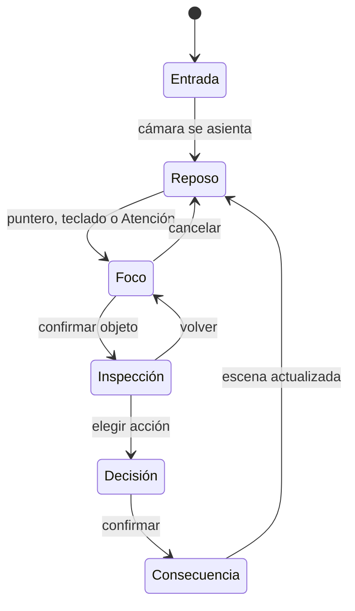

# Path to Godhood — Plan de recuperación UI/UX jugable

**Versión:** 1.0  
**Fecha:** 15 de septiembre de 2026  
**Estado del proyecto:** Fase 1 abierta  
**Marco operativo:** BRIEF-10 + BRIEF-10.VISUAL + Gates G1–G5  
**Objetivo:** convertir el frontend actual en una experiencia diegética, moderna, legible y realmente jugable sin reescribir los motores de dominio ni ampliar el alcance del vertical slice.

---

## 0. Decisión ejecutiva

La UI no necesita otra ronda de “mejoras de Tailwind”. Necesita una recuperación dirigida por escena, interacción y prueba humana.

El frontend actual sí contiene una buena idea de producto —El Desván como centro físico y los estados representados por objetos—, pero su ejecución todavía se percibe como un dashboard web oscuro: botones tipo píldora, iconos genéricos, rectángulos con gradientes, objetos pequeños y ventanas modales sin continuidad espacial. Cumple parcialmente la letra de “estado = objeto”, pero no consigue que El Desván se sienta como un lugar ni que las acciones formen un juego.

La recuperación se realizará con cinco decisiones:

1. **El Desván será una escena, no una cuadrícula de componentes.** Tendrá cámara, profundidad, iluminación, capas, zonas interactivas y una composición aprobada antes de escribir JSX de producción.
2. **La diegesis servirá a la decisión.** No habrá HUD numérico, pero cada objeto tendrá silueta, estado, respuesta, foco, texto bajo demanda y una acción inequívoca.
3. **La navegación será una máquina de estados central.** Se eliminará el conjunto de booleanos y modales locales como forma principal de navegación.
4. **La calidad se probará con capturas y personas.** Ningún “se ve mejor” será aceptado sin comparación visual, recorrido jugable y evidencia de uso con teclado.
5. **La Fase 1 seguirá abierta.** Este plan no autoriza nuevas vías, contenido canónico, Three.js, cambios de balance ni una declaración de cierre de fase.

### Resultado esperado

Al finalizar, un jugador nuevo deberá poder:

- comprender que está en un desván habitable y peligroso;
- descubrir qué objetos puede tocar sin ver una barra de navegación;
- organizar una franja del día;
- investigar una pista y conectarla en el corcho;
- resolver un dilema de actuación;
- comprar o rechazar un objeto en el bazar;
- entrar y salir de un encuentro táctico;
- regresar al escritorio y **ver físicamente** las consecuencias de sus decisiones;
- completar el prólogo y la ceremonia del Trago sin asistencia externa.

El objetivo de producción realista es un **vertical slice UI de 10 a 12 semanas** para una persona desarrolladora con apoyo puntual de arte/sonido, o de 6 a 8 semanas con una dupla frontend + artista técnico. La calidad visual dependerá de activos de arte dirigidos; no puede alcanzarse sólo con CSS.

---

## 1. Autoridad, alcance y reglas de precedencia

### 1.1 Fuentes obligatorias

Antes de cada sub-brief, el agente debe leer:

1. la instrucción más reciente y firmada por el Director;
2. `AGENTS.md — MAPA OPERATIVO POST-PURGA (v4.0)`;
3. `PATH TO GODHOOD — BIBLIA TÉCNICA DEL MOTOR (LEGADO v4.0)`, especialmente §0, §4 y §6–§9;
4. el contrato visual aprobado que resulte de BRIEF-10.VISUAL-R1;
5. el código actual de `ui/` y sus pruebas.

Si existe contradicción, el agente no la resuelve por intuición: registra `[CONFLICTO_DE_AUTORIDAD]`, cita ambas fuentes y detiene sólo la parte afectada para decisión del Director.

### 1.2 Alcance permitido

**Permitido sin ampliar autorización:**

- `ui/src/**`;
- pruebas del frontend;
- historias visuales y fixtures deterministas del frontend;
- activos visuales y sonoros propios de la UI;
- scripts de auditoría exclusivamente relacionados con UI;
- documentación de BRIEF-10.VISUAL.

**Sólo con aprobación previa:**

- DTOs o endpoints en `reborn/src/server/**` necesarios para presentar estados diegéticos;
- nuevas dependencias de producción;
- modificación de un contrato de datos ya consumido por el frontend.

**Fuera de alcance:**

- `reborn/data/content/**` — Tier L inmutable;
- balance, probabilidades o costes;
- lógica de los 11 motores core;
- nuevas vías, casos, NPC o finales;
- reintroducir Three.js o reconstruir el juego en otro motor;
- paridad móvil completa durante este vertical slice;
- declarar concluida la Fase 1.

### 1.3 Plataforma objetivo

La Fase 1 será **desktop-first**:

- objetivo principal: 1440 × 900;
- soporte verificado: 1280 × 720, 1366 × 768, 1920 × 1080 y 2560 × 1440;
- ultrawide: escena centrada con extensión ambiental, sin estirar objetos;
- menos de 1024 px de ancho: modo de compatibilidad con mensaje diegético y navegación simplificada, no rediseño móvil completo.

Esta decisión protege el alcance indie y permite que la composición se comporte como un escenario de videojuego, no como una página web que se redistribuye arbitrariamente.

---

## 2. Diagnóstico verificable del archivo UI actual

### 2.1 Lo que debe conservarse

- Separación conceptual por objetos: vela, espejo, grietas, libro, papeles, bolsa, corcho, cáliz y almanaque.
- Estados visuales por tiers para Sanidad, Corrupción y Ruina.
- React + TypeScript + Vite como base adecuada para el vertical slice.
- SVG/CSS para efectos cinéticos pequeños; no hace falta un motor 3D.
- Lógica de “prosa bajo demanda”.
- Backend determinista y persistente como autoridad del estado del juego.

### 2.2 Por qué ahora se ve mal o poco jugable

| Evidencia en código actual | Problema que produce | Corrección de dirección |
|---|---|---|
| `h-[36vh]` + `h-[64vh]`, `overflow-hidden` y anchos fijos | Composición rígida, solapamientos y recortes fuera de una sola resolución | Escenario lógico 16:9 escalable con safe areas y pruebas por viewport |
| `flex justify-between` para colocar objetos | Los elementos parecen una fila de widgets, no cosas sobre una mesa con perspectiva | Posicionamiento en coordenadas de escena aprobadas y capas de profundidad |
| Botones de “Velo”, “Almanaque”, “Bazar” y “Guardia” con iconos Lucide | Apariencia de dashboard administrativo disfrazado de victoriano | Convertir las acciones en hotspots semánticos sobre objetos físicos |
| Objetos construidos principalmente con `div`, bordes, gradientes y `rounded` | Siluetas genéricas, materiales poco convincentes y falta de autoría visual | Activos transparentes 2D/2.5D con estados, máscaras de luz y detalles SVG sólo donde aporten movimiento |
| `hover:scale-105` repetido | Movimiento de plantilla web; rompe peso y materialidad | Respuesta por elevación mínima, luz rasante, sonido y desplazamiento de 1–3 px |
| `onMouseEnter` y etiquetas sólo al hover | El flujo no funciona bien con teclado, tacto ni usuarios que no descubren el hotspot | Foco visible, navegación secuencial, modo Atención y descripciones persistentes durante foco |
| `div onClick` para objetos | Semántica y accesibilidad insuficientes | Hit areas implementadas como `button` sin cromado, con nombre accesible y foco restaurable |
| `useState` local para cada modal/inspección | Pueden coexistir estados incompatibles; Escape, back y restauración de foco se vuelven frágiles | Una sola máquina de navegación de UI |
| Modal genérico centrado para el diario | Rompe la ilusión espacial y convierte cada acción en una ventana web | Transición de cámara al objeto y superficie de lectura anclada a él |
| Título, profesión y secuencia flotando sobre la pared | La identidad vuelve a ser HUD y compite con los papeles notariales | Mover la identidad a los papeles; reservar texto flotante para momentos excepcionales |
| `DeskCracksOverlay` cubre toda la mesa con un SVG interactivo | Riesgo de capturar eventos y crear una zona clicable ambigua | Separar render visual de hit area y limitar inspección a regiones explícitas |
| Keyframes y colores embebidos dentro de componentes | Duplicación, colisiones de IDs SVG y dirección visual inconsistente | Tokens, motion presets y defs SVG únicos a nivel de escena |
| El libro muestra historial, pero no ejecuta el dilema diario | Hay presentación de estado, no un ciclo jugable completo | Diseñar situación → opciones → confirmación → consecuencia → retorno |
| No existe contrato de captura visual | El agente puede “cumplir” cambiando código sin mejorar la escena | Baselines de capturas, diff visual y firma humana antes de integrar |

### 2.3 Diagnóstico central

La causa no es que falten más sombras, colores o animaciones. Falta una **gramática de interacción de videojuego**:

> entrar en escena → percibir una llamada → enfocar un objeto → inspeccionarlo → tomar una decisión → confirmar el coste → recibir una consecuencia → volver a una escena físicamente cambiada.

Mientras cada componente sea una tarjeta autónoma que abre un modal, la UI seguirá sintiéndose como una aplicación web temática.

---

## 3. Contrato de experiencia: “El Desván es el nivel cero”

### 3.1 Tesis de diseño

**El Desván no es el menú principal. Es el primer mapa del juego.**

Debe comunicar simultáneamente:

- hogar precario;
- centro de operaciones;
- identidad civil;
- laboratorio ocultista;
- reloj de presión;
- cuerpo/mente del personaje proyectados sobre el entorno.

### 3.2 Principios operativos

1. **Estado = objeto.** Vela, azogue y madera cambian antes de que aparezca cualquier explicación.
2. **Momento = prosa.** La prosa entra cuando el jugador enfoca, decide, falla, descubre o realiza un ritual.
3. **Una llamada principal por momento.** Puede haber varios objetos disponibles, pero sólo uno debe comunicar urgencia primaria.
4. **Forma antes que etiqueta.** Un objeto debe reconocerse por silueta, posición, material y respuesta; el texto confirma, no rescata.
5. **Progresión visible en el lugar.** Cartas nuevas, polvo removido, cera derramada, grietas, pagos vencidos y pistas fijadas hacen que la habitación recuerde.
6. **La información aparece por capas.** Reposo → foco → inspección → decisión → consecuencia.
7. **Cada salida tiene retorno.** Escape, volver y cerrar siempre restauran el foco al objeto de origen.
8. **La opacidad es dramática, no confusa.** Los números pueden permanecer ocultos sin ocultar qué acciones existen ni qué consecuencias cualitativas están en juego.
9. **El sonido confirma materia.** Papel, metal, cuero, madera, viento, llama y pasos sustituyen parte del feedback de un HUD.
10. **El mundo nunca se congela sin intención.** Al volver de una acción, la luz, la hora y al menos un objeto deben reflejar el tiempo o la consecuencia.

### 3.3 Bucle de interacción objetivo



No se permitirá que cada objeto invente su propio patrón de navegación.

---

## 4. Arquitectura de la experiencia y pantallas

### 4.1 El Desván — hub físico

La cámara se sitúa en tres cuartos, con pared, repisa, corcho, ventana, escalera y tablero de caoba formando una sola ilustración coherente. Los objetos interactivos se distribuyen por profundidad, no por columnas Flexbox.

| Objeto o lugar | Sistema | Acción primaria | Tratamiento espacial | Señal de retorno/consecuencia |
|---|---|---|---|---|
| Vela de sebo | Somática / estabilidad | Examinar el propio estado | Primer plano lateral con respiración de luz | Llama, humo, cera y sonido cambian |
| Espejo de azogue | Corrupción / Visión Espiritual | Mirar o sostener para abrir el Velo | Zoom corto; reflejo responde antes que el cuarto | Nueva capa espectral sobre la misma escena |
| Grietas de la mesa | Ruina | Examinar una fractura permanente | La cámara recorre una región concreta, no todo el SVG | Una fisura nueva permanece en el escritorio |
| Libro de actuación | Acting | Leer situación y responder | El libro se abre en la mesa; páginas físicas | Nueva anotación, mancha o margen firmado |
| Papeles notariales | Identidad y anclas | Revisar coartada, empleo y vínculos | Documentos se despliegan sin abandonar la mesa | Sellos, cartas y daños en anclas |
| Bolsa de cuero | Economía | Revisar fondos/deuda | Peso, volumen, monedas y recibos; cifras sólo cuando la transacción lo exija y la ley lo autorice | Bolsa más ligera, pagaré o aviso de casera |
| Almanaque/reloj | Calendario | Elegir acción de la franja | Se abre un planificador físico de cuatro momentos | Luz y ambiente avanzan |
| Carta sellada | Bazar | Visitar/intercambiar | La carta abre una transición hacia el puesto | Paquete, recibo o espacio vacío al volver |
| Corcho | Investigación | Organizar pistas e hipótesis | La cámara asciende y ocupa casi todo el viewport | Nuevos hilos y tarjetas permanecen |
| Cáliz | Ascensión | Revisar las Cinco Puertas / beber | Escena ceremonial; todo lo demás se oscurece | Cambio irreversible del cuarto y del personaje |
| Escalera/picaporte | Amenaza / combate | Responder a una intrusión | Evento contextual, no botón permanente | Daños, desorden, silencio o presencia residual |

### 4.2 Sustitución del HUD actual

- El título del lugar aparecerá sólo durante la entrada y desaparecerá.
- Profesión, origen, anclas y carga vivirán en los papeles.
- La secuencia se comunicará en el libro, símbolos, rituales y diálogo; no como subtítulo global permanente.
- “Abrir el Tercer Ojo” dejará de ser una píldora y pasará al espejo mediante **sostener**.
- “Almanaque”, “Bazar” y “Guardia” dejarán de ser botones con iconos; serán reloj, carta y picaporte.
- Lucide podrá permanecer en superficies funcionales secundarias o de accesibilidad, pero no en el plano diegético principal.

---

## 5. Dirección visual de primer nivel

### 5.1 Referente compositivo

La dirección recomendada es **ilustración 2D/2.5D por capas con perspectiva pictórica**, no 3D en tiempo real:

- fondo del desván pintado a 2×;
- objetos interactivos transparentes con 4–5 variantes de estado;
- sombras de contacto y mapas de luz separados;
- fuego, humo, polvo, reflejo e hilos como SVG/CSS/canvas ligero;
- cámara simulada con `transform`, desenfoque y parallax mínimo;
- transición de hora mediante capas de luz, no recoloración global plana.

### 5.2 Composición

- El objeto activo ocupa entre 12% y 22% del área visual útil al recibir foco.
- La escena mantiene una zona de lectura segura en el tercio inferior/central.
- No más de una fuente primaria de brillo simultánea, salvo durante Visión Espiritual.
- La pared contiene investigación y amenaza; la mesa contiene identidad, cuerpo y decisiones; la repisa contiene ascensión.
- Los objetos no se alinean a una misma línea base: se solapan por perspectiva y profundidad.
- La cámara usa posiciones discretas: `wide`, `desk-left`, `desk-center`, `desk-right`, `wall-board`, `ritual`, `combat`.

### 5.3 Materiales

Cada objeto necesita una ficha de arte con:

- silueta;
- perspectiva y escala;
- material dominante;
- estado limpio;
- estados alterados;
- sombra de contacto;
- región de interacción;
- región de animación;
- respuesta sonora;
- texto de reposo de máximo siete palabras;
- descripción al inspeccionar;
- fallback para movimiento reducido.

### 5.4 Tipografía y Tokens

- Máximo dos familias en producción: Cinzel (display ceremonial) y Serif legible (lectura y decisiones).
- Tokens centralizados en `scene.tokens.css`:

```css
:root {
  --scene-void: #090807;
  --scene-ink: #17120e;
  --material-mahogany: #402717;
  --material-brass: #a68444;
  --paper-base: #e8dcc4;
  --paper-ink: #241d16;
  --signal-danger: #8f2f31;
  --signal-ether: #7961a8;
  --focus-ring: #f0d48d;
  --shadow-contact: 0 12px 24px rgb(0 0 0 / 45%);
  --motion-instant: 100ms;
  --motion-object: 220ms;
  --motion-camera: 480ms;
}
```

---

## 6. Arquitectura técnica recomendada

```text
ui/src/
├── app/
│   ├── GameShell.tsx
│   ├── gameUi.machine.ts
│   └── routes.ts
├── scene/
│   ├── SceneViewport.tsx
│   ├── SceneCamera.tsx
│   ├── InteractionLayer.tsx
│   ├── FocusAnnouncer.tsx
│   └── scene.tokens.css
├── features/
│   ├── desk/
│   │   ├── DeskScene.tsx
│   │   ├── desk.layout.ts
│   │   ├── desk.viewmodel.ts
│   │   ├── objects/
│   │   └── __stories__/
│   ├── investigation/
│   ├── calendar/
│   ├── acting/
│   ├── identity/
│   ├── market/
│   ├── combat/
│   ├── ascension/
│   └── prologue/
├── shared/
│   ├── api/
│   ├── audio/
│   ├── motion/
│   ├── a11y/
│   └── test-fixtures/
└── assets/
    ├── desk/
    ├── objects/
    ├── effects/
    └── audio/
```

---

## 7. Roadmap de 10–12 semanas

| Sub-Brief | Denominación | Foco y Entregables |
| :--- | :--- | :--- |
| **BRIEF-10.VISUAL-R0** | **Auditoría y Baseline** | Diagnóstico real del repo, sin cambios a código de producción, inventario de huecos para `HUMAN_REVIEW`. |
| **BRIEF-10.VISUAL-R1** | **Contrato UX y Composición** | Wireframes en `wide`, `focus`, `inspection`, mapa de teclado, tabla de objetos/estados, tokens CSS. |
| **BRIEF-10.VISUAL-R2** | **Fundamentos de Escena** | `SceneViewport` 16:9, safe areas, cámara tipada, `ObjectHotspot` semántico y máquina de navegación. |
| **BRIEF-10.VISUAL-R3** | **El Desván como Lugar** | Fondo por capas, iluminación de 4 franjas, objetos físicos con estados y modo Atención. |
| **BRIEF-10.VISUAL-R4** | **Calendario, Identidad y Acting** | Almanaque jugable, papeles notariales, libro de dilemas conectado a API sin mostrar números. |
| **BRIEF-10.VISUAL-R5** | **Investigación** | Corcho con zoom/pan, hilos Bézier por color/patrón, conexiones y prueba de hipótesis con caducidad. |
| **BRIEF-10.VISUAL-R6** | **Mercado e Inventario** | Transición al bazar, mostrador material, compras persistidas en SQLite. |
| **BRIEF-10.VISUAL-R7** | **Combate Táctico** | Rejilla $5 \times 7$, escrutinio, revelación atómica, 8 estados diferenciados y persistencia Kill-9. |
| **BRIEF-10.VISUAL-R8** | **Prólogo y Ascensión** | Onboarding lineal, Cinco Puertas físicas, Hold-to-Drink de 3s con telemetría de hesitación. |
| **BRIEF-10.VISUAL-R9** | **Pulido y Calidad** | Audio foley, motion pass, accesibilidad WCAG 2.2, E2E y regresión visual estable. |
| **BRIEF-10.VISUAL-R10**| **G4 y Evaluación Humana** | Protocolo con 3 evaluadores ciegos, corrección de P0/P1 y veredicto del Director. |

---

## 8. Definición de Terminado de la UI del Vertical Slice

La UI se considera candidata a firma cuando:

1. El Desván se percibe como un lugar continuo en las cinco resoluciones objetivo ($1280 \times 720$ a $2560 \times 1440$).
2. No hay HUD numérico prohibido, píldoras ni tarjetas genéricas en el plano principal.
3. Vela, espejo y madera comunican sus estados somáticos sin necesidad de explicaciones abstractas.
4. Todos los objetos tienen estados: reposo, hover, foco, activo, bloqueado, urgente y cambiado.
5. El 100% de los flujos P0 son jugables tanto con mouse como con teclado.
6. Escape, volver y restauración de foco funcionan de forma uniforme en toda la aplicación.
7. Las acciones irreversibles esperan confirmación del servidor y persisten en SQLite.
8. La suite completa de auditorías diegéticas, pruebas unitarias y de integración pasan con 100% de éxito.
9. El Director firma formalmente la demo tras la ejecución del Gate G4 humano.
